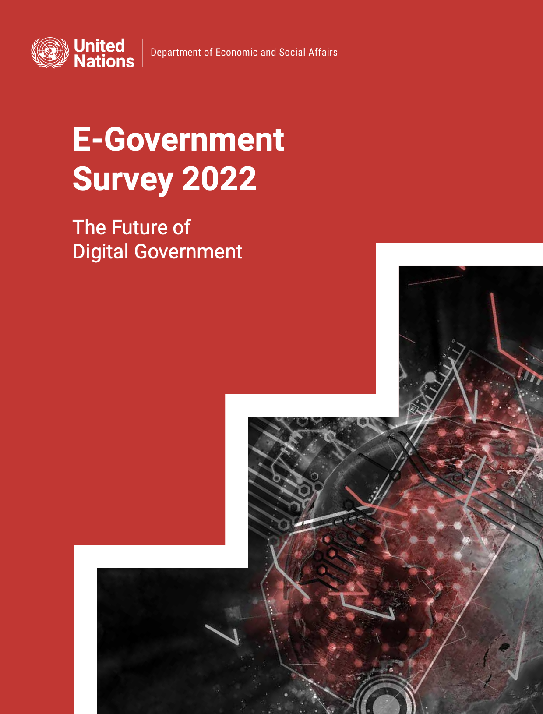

```{r setup, include=FALSE}
knitr::opts_chunk$set(warning = FALSE, message = FALSE) 
```

<center></center>

```{r,echo=FALSE, out.width="30%"}
knitr::include_graphics("logoPUCP.png") 
```

**FACULTAD DE CIENCIAS SOCIALES - PUCP**<br>

## Curso: POL 278 - Estadística para el análisis político 1 \| Semestre 2024 - 1 <br>

## **Repaso**

### **E-Government Survey 2022: The Future of Digital Government**

La Encuesta de las Naciones Unidas sobre Gobierno Electrónico se ha publicado cada dos años por el Departamento de Asuntos Económicos y Sociales de las Naciones Unidas desde 2001. La Encuesta evalúa el estado de desarrollo del gobierno electrónico de todos los Estados miembros de las Naciones Unidas y, durante este tiempo, ha establecido un conjunto de datos y análisis exhaustivos.

La evaluación mide el rendimiento del gobierno electrónico de los países en relación con los demás, en lugar de ser una medición absoluta. Reconoce que cada país debe decidir el nivel y la extensión de sus iniciativas de gobierno electrónico de acuerdo con sus propias prioridades nacionales de desarrollo y para lograr los Objetivos de Desarrollo Sostenible. La Encuesta sirve como una herramienta de referencia y desarrollo para que los países aprendan entre sí, identifiquen áreas de fortaleza y desafíos en el gobierno electrónico y moldeen sus políticas y estrategias. También tiene como objetivo facilitar e informar las discusiones de los órganos intergubernamentales, incluida la Asamblea General de las Naciones Unidas, el Consejo Económico y Social y el Foro Político de Alto Nivel.

```{r,echo=FALSE, out.width="50%",fig.align="center"}
 
```

Carguemos la data *egov2022.xlsx*

```{r}
library(dplyr)#Convocamos el paquete
library(rio)    
data=import("egov2022.xlsx") 
```

| Nombre         | Descripción                                                                          |
|----------------------|--------------------------------------------------|
| Pais           | Nombre del país                                                                      |
| E_gov          | Indicador de gobernanza digital (0-100)                                              |
| E_part         | Transparencia y acceso a la información, participación ciudadana en línea (0 - 100)  |
| Online_service | Servicios en línea otorgado por el Estado (0-100)                                    |
| Human_cap      | Miembros del Estado especializados en el tema (0-100)                                |
| Tele_infra     | Índice de capacidad de redes de telecomunicaciones como acceso a internet 5G (0-100) |
| Alto_teleinfra | ¿El país tiene un índice de infraestructura mayor a 80? Si/No                        |
| Region         | Continente donde pertenece cada país                                                 |

# **1.Recordando el análisis descriptivo**

-   **Moda**: Nominales, ordinales y numéricas
-   **Mediana**: Ordinales y numéricas
-   **Media**: Numéricas

Revisamos la estructura de la base de datos y sus variables

```{r}
str(data)
```

Podemos ver que casi todas las variables son numéricas, excepto la variable *Region* que se muestra como texto, pero es categórica. Procedemos a revisar sus niveles y a recodificarla.

```{r}
data %>% 
 group_by(Region) %>% 
  summarize(Freq=n())
```

```{r}
data$Region=as.factor(data$Region)
class(data$Region) #Comprobamos
```

# **2. Aplicación en R**

### **¿Cuál es el estado de la gobernanza digital de los países?**

-   **¿El país tiene un nivel alto de infraestructura en telecomunicaciones? (**Alto_teleinfra) : Variable categórica

Realicemos una tabla de frecuencias de la variable:

```{r}
para_grafico= data %>%
  group_by(Alto_teleinfra) %>% 
  summarise(Freq=n())
```

¿Qué nos indica la tabla? En este caso, ¿cuál sería la moda?

Revisemos en un gráfico:

```{r}
library(ggplot2)
ggplot(para_grafico, aes(x=Alto_teleinfra, y = Freq, fill=Alto_teleinfra))+
  geom_bar(stat = "identity")+ xlab("Alto nivel de infraestructura en telecomunicaciones")+ylab("Frecuencia")
```

-   **E-Government Index**: Variable numérica

Revisamos *solo* la media del E_gov

```{r}
data  %>% 
  summarise(media=mean(E_gov))
```

Ahora realizamos análisis descriptivo y de dispersión. ¿Qué podemos comentar de los datos obtenidos?

```{r}
data  %>% 
  summarise(Mínimo=min(E_gov), 
            Mediana= median(E_gov), 
            Desviación=sd(E_gov),
            Media= mean(E_gov),
            Máximo= max(E_gov))
```

-   ¿Cuál es el puntaje más bajo y el máximo?

-   ¿Cuál es el rango? (*max-min*)

-   **Desviación estándar (*sd*)**: *La desviación estándar es una medida que nos ayuda a entender cuánto se separan los números en un conjunto de datos del valor promedio o medio. Podemos traducir ello como una forma de medir cuánto "se dispersan" los números alrededor de un número central.*

-   ¿Hay mucha variabilidad en los datos? *sd*

## **Visualización**

Histograma de E-Gov

```{r}
data %>%
  ggplot(aes(x=E_gov))+
  geom_histogram(fill = "blue",
    color = "black",
    bins = 30,
    alpha = 0.7)+
  xlab("E-Government Index") +
  ylab("Frecuencia")+
   theme_minimal()
```

Histograma de E-Gov + mediana (rojo) + media (verde)

```{r}
data %>%
ggplot(aes(x=E_gov))+
  geom_histogram(fill = "blue",
    color = "black",
    bins = 50,
    alpha = 0.7)+
  geom_vline(xintercept = median(data$E_gov), color = "red")+
  geom_vline(xintercept = mean(data$E_gov), color = "green")+
  xlab("E-Government Index") +
  ylab("Frecuencia")+
  theme_light()
```
```{r}
summary(data$E_gov)
```

### Cuartiles y diagrama de cajas


```{r}
data %>% 
  filter(Region=="Africa")%>% 
  summarise(CuartilesEgov = quantile(E_gov))
```

```{r}
data %>% 
  summarise(CuartilesEgov = quantile(E_gov))
```

¿Cómo ubicamos los cuartiles en el diagrama de cajas?

```{r}
data %>% 
  ggplot(aes(y=E_gov))+
  geom_boxplot()+
  ylab("E-Government Index")
```

## **Según región, ¿cuál es el estado de la gobernanza digital de los países?**

¿Cuál es la importancia de analizar por regiones?

```{r}
data %>%
 group_by(Region) %>%
  summarize(Media=mean(E_gov)) 
```

```{r}
data %>%
  ggplot(aes(x=E_gov))+
  geom_histogram()+
  facet_wrap(~Region)+
  xlab("E-Gov Index")+
  ylab("Frecuencia")
```

Analicemos los resultados 😼

**Descriptivos por región**

```{r}
 data %>%
  group_by(Region)%>%
  summarise(Mínimo=min(E_gov), 
            Mediana= median(E_gov), 
            Desviación=sd(E_gov),
            Media= mean(E_gov),
            Máximo= max(E_gov))
```

Comparo los resultados y los ubico en mi diagrama de cajas

```{r}
 data %>%
ggplot(aes(x=Region, y=E_gov, color=Region)) + 
  geom_boxplot() + 
  geom_jitter(shape=16, position=position_jitter(0.2)) +#para agregar los casos como puntos
  theme_classic()
```

Si deseo un subset solamente de los países que están por encima de la media ¿cuántos países son?

```{r}
MayorMedia=data %>%
  filter(E_gov > mean(E_gov)) 
```

Si queremos ver solo una región, en este caso África

```{r}
data %>% 
  filter(Region =="Africa") %>%
  summarise(mean(E_gov))
```

O los estadísticos de los países de Asia

```{r}
data %>%
  filter(Region == "Asia") %>%
  summarise(Mínimo=min(E_gov), 
            Mediana= median(E_gov), 
            Desviación=sd(E_gov),
            Media= mean(E_gov),
            Máximo= max(E_gov))
```

# **3. Ejercicios 👾 :**

-   Realizar los estadísticos descriptivos del Online Service Index (Online_Service).
-   Realizar una muestra de aquellos paises que están por encima de la media del índice de infraestructura y telecomunicaciones (Tele_infra).
-   Realizar diagrama de cajas del E-Participation Index (E_part) por región.
-   Según si tiene alto nivel de infraestructura en telecomunicaciones (Alto_teleinfra), calcula los cuartiles de la variable Human_cap, y luego genera un gráfico que los muestre.
