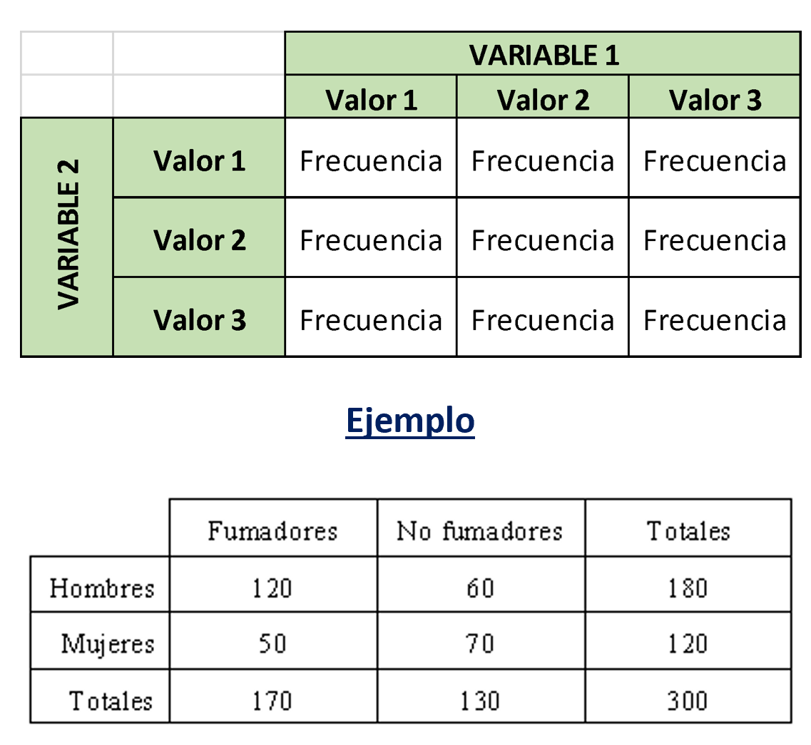
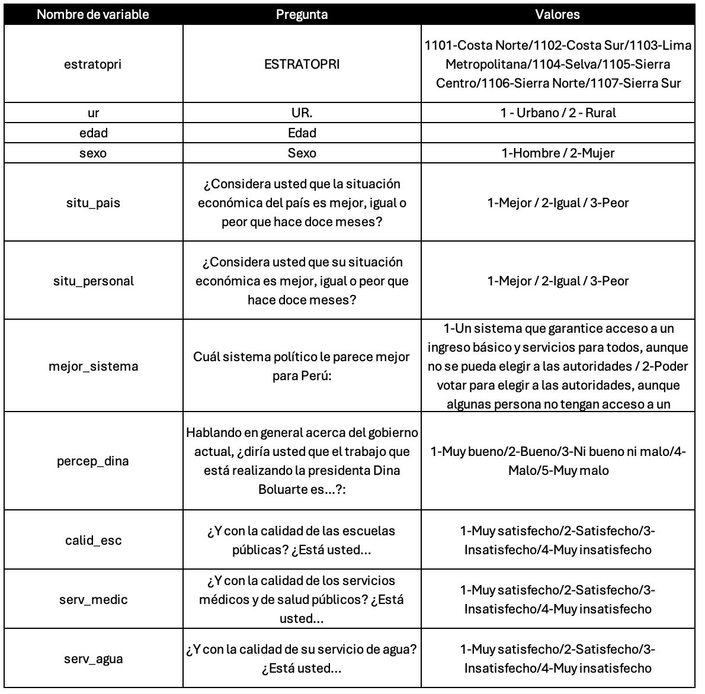

```{r,echo=FALSE, out.width="30%"}
knitr::include_graphics("logoPUCP.png") 
```

**FACULTAD DE CIENCIAS SOCIALES - PUCP**<br>

## Curso: POL 278 - Estadística para el análisis político 1 \| Semestre 2024 - 1 <br>

------------------------------------------------------------------------

# **Tablas de contingencia y prueba Chi2**

# Tablas de contingencia

-   Son tablas de doble entrada, en las cuales se cruzan las categorías de dos variables de interés.
-   En las casillas de la tabla se ubica la frecuencia o el número de casos de cada cruce.
-   Conceptos importantes: Frecuencias observadas y frecuencias esperadas.



### **Frecuencias observadas y esperadas**

-   Frecuencia esperada: Estas son las frecuencisa que deberían darse si las variables fueran independientes.

-   Frecuencia observada: Estas son las frecuencias reales que se observa en nuestra data.

Ejemplo:


# Prueba Chi2

Chi2 es una prueba para estimar el grado de asociación entre variables categóricas: "Nominal - Nominal", "Nominal - Ordinal" y "Ordinal - Ordinal".
Esto significa que una parte de la variabilidad de una variable puede ser explicada por otra variable.

**Supuestos:**

Para analizar asociación se requiere que el número de observaciones esperadas en cada celda de la tabla de contingencia debe ser suficientemente grande.

Para fines de este curso, al menos cada celda de la TC de frecuencias esperadas debe ser de 5.

Ten en cuenta que si estas condiciones no se cumplen, entonces la prueba podría no funcionar adecuadamente y los resultados de la prueba podrían no ser válidos.
Si es que encuentran que no se cumple este supuesto: Repórtalo!

**Hipótesis:**

-   Hipótesis nula (H0): Las variables son estadísticamente independientes (No hay asociación).

-   Hipótesis alternativa (H1): Las variables son estadísticamente dependientes (Sí hay asociación).

# Pregunta de investigación

```{=html}
<style>
.custom-text {
  color: #00688B;
  font-family: Helvetica, sans-serif;
  text-align: center;
  font-weight: bold;
  font-size: 22px;
}
</style>
```
::: custom-text
¿Cuál es la percepción de la situación del país a partir de variables socioeconómicas ?
🤔
:::

Para poder responder a la anterior pregunta se usará la base de datos del Latin American Public Opinion Project (LAPOP[^1]) 2023.
Este es un estudio de la Universidad de Vanderbilt que realiza encuestas de opinión pública en 34 países de América, incluyendo Norte, Centro, Sur y el Caribe.
LAPOP mide actitudes, evaluaciones y experiencias en diversos temas, proporcionando datos comparativos de alta calidad sobre la democracia, la gobernabilidad y el desarrollo social en la región.

[^1]: <https://www.vanderbilt.edu/lapop/ab2023/AB2023-Pulso-de-la-democracia-final-20240219.pdf>

Cargamos la data:

```{r warning=FALSE,message=FALSE}
library(rio)
library(dplyr)
lapop=import("peru2023.sav")
str(lapop)
```

Diccionario de datos



## 🔵 ¿Existe diferencia sobre la percepción económica actual entre hombres y mujeres?

-   Pregunta en cuestionario LAPOP: *¿Considera usted que la situación económica del país es mejor, igual o peor que hace doce meses?*
-   Situación económica: 1 (Mejor), 2 (Igual), 3 (Peor)

**PASO 0: Revisamos la estructura de las variables que nos interesan:**

```{r }
lapop <- lapop %>%
  mutate(situ_pais = factor(situ_pais, levels = 1:3, labels = c("Mejor", "Igual", "Peor")))

str(lapop$situ_pais) #verificamos

```

A nivel general, ¿qué percibe la mayoría sobre la situación económica del país?

```{r}
resultados = lapop %>%
  count(situ_pais) %>%
  mutate(percentage = n / sum(n) * 100)
resultados
```

Variable sexo: nominal 1 - Hombre 2 - Mujer

```{r eval=F}
str(lapop$sexo)
table(lapop$sexo)
```

Les damos el formato adecuado:

```{r}
lapop$sexo = factor(lapop$sexo, levels = 1:2, labels = c("Hombre","Mujer"))
table(lapop$sexo)
```

**PASO 1: Tabla de contingencia**

Los valores observados son los valores de nuestra tabla tal como la tenemos en nuestra base.

```{r }
tabla1=table(lapop$situ_pais, lapop$sexo) #tabla simple
tabla1
```

Creamos porcentajes por columna, para ello tenemos que agregar prop.table al comando anterior.
El argumento de prop.table puede ser 1: *para calcular porcentaje por fil*, o 2: *para calcular por columna* ⚠️

```{r}
tablapor1 = tabla1 %>%
           prop.table(2) %>%  
           round(2) #redondear el resultado a 2 decimales
tablapor1
```

> ¿Existe diferencia con lo que vemos a nivel de cada subgrupo (hombre y mujer) respecto a lo que habíamos visto a nivel de toda la muestra?

**PASO 2: Diagrama de barras apiladas**

Preparamos la data para graficar: 1.
Necesitamos que sea un data frame

```{r }
toPlot1 = as.data.frame(tablapor1) 
names(toPlot1) = c("Categoria", "Sexo", "Porcentaje")
toPlot1
```

Generamos el gráfico y lo solicitamos:

```{r }
library(ggplot2)

toPlot1 %>% 
  ggplot()+
  aes(x=Sexo, y=Porcentaje*100, fill=Categoria) +
  geom_bar(position="stack", stat="identity")+ #Stack indica que son barras apiladas
  geom_text(aes(label=paste0(Porcentaje*100,"%")), 
            position = position_stack(), 
            vjust=1, size = 3)+
  labs(x="Sexo", y="Porcentaje", fill="Situación económica")+
  theme_bw()
```

> De forma preliminar, ves diferencias entre la forma cómo se distribuye la variable "Situación Económica" en cada subgrupo (hombre y mujer)?

**PASO 3: Prueba Chi cuadrado**

-   H0: El sexo es estadísticamente independiente de la situación económica respecto del año pasado

-   HA: El sexo es estadísticamente dependiente de la situación económica respecto del año pasado

Para hacer el test ingresamos la tabla de frecuencias

```{r }
chisq.test(tabla1)
```

De acuerdo al p--value obtenido en la prueba de hipótesis de Chi2, al ser menor de 0.05, podemos rechazar la hipótesis nula (Las variables son independientes).

Por lo tanto, concluimos existe dependencia entre las variables escogidas: sexo y situación económica actual.
Esto quiere decir que el ser hombre o mujer sí se refleja en la percepción de la situación económica del país.

**SUPUESTO**

Ten en cuenta que si te piden verificar el supuesto sólo tienes que solicitar la tabla de frecuencias esperadas y ver que efectivamente todas las celdas tienen un número igual o mayor a 5.

```{r}
chisq.test(tabla1)$expected
```

En este caso sí cumple el supuesto!
😎

## 🔵¿Existe relación entre zona de vivienda y la percepción de la gestión de Boluarte? 

*PASO 0: Revisamos la estructura de las variables que nos interesan:*

-   Variable percep_dina: 1 (Muy bueno), 2 (Bueno), 3 (Ni bueno, ni malo), 4 (Malo), 5 (Muy malo).

Para este ejercicio creemos solo tres grupos "Buena" (1/Muy bueno y 2/Bueno), "Ni buena ni mala" (3/Ni bueno ni malo) y "Mala" (4/Malo, 5/Muy malo)

```{r eval=F}
str(lapop$percep_dina)
```

```{r }
lapop = lapop %>% 
  mutate(percep_dina2=case_when(percep_dina<=2 ~ "Buena",
                                percep_dina==3 ~ "Ni buena ni mala",
                                T ~ "Mala"))

lapop$percep_dina2 = as.factor(lapop$percep_dina2)
```

Estrato: 1-Urbano 2-Rural

```{r }
lapop$ur = factor(lapop$ur, 
                      levels = c(1:2),
                      labels = c("Urbano","Rural"))
table(lapop$ur)
```

**PASO 1: Tabla de contingencia**

Los valores observados son los valores de nuestra tabla tal como la tenemos en nuestra base

```{r }
tabla2 = table(lapop$percep_dina2, lapop$ur)
tabla2
```

Creamos porcentajes por columna:

```{r message= FALSE}
tablapor2 = tabla2 %>%
  prop.table(2) %>%  # porcentaje por columna
  round(3)
tablapor2
```

Creamos porcentajes por fila:

**PASO 2: Diagrama de barras apiladas**

Preparamos la data para graficar:

```{r }
toPlot2 = as.data.frame(tablapor2) 
names(toPlot2) = c("Categoria", "Estrato", "Porcentaje")
toPlot2
```

Generamos el gráfico y lo solicitamos:

```{r}
toPlot2 |> 
  ggplot()+
  aes(x=Estrato, y=Porcentaje*100, fill=Categoria) +
  geom_bar(position="stack", stat="identity")+
  geom_text(aes(label=paste(Porcentaje*100,"%")), 
            position = position_stack(), 
            vjust=1, size = 3)+
  labs(x="Estrato", y="Categoría", fill="Confianza")+
  theme_bw()

```

**PASO 3: Prueba Chi cuadrado**

-   H0: La percepción de la gestión de Dina es estadísticamente independiente del estrato del encuestado

-   HA: La percepción de la gestión de Dina es estadísticamente dependiente del estrato del encuestado

```{r }
chisq.test(tabla2)
```

🗯️ De acuerdo al p-value obtenido en la prueba de hipótesis de Chi2, al ser menor de 0.05, podemos rechazar la hipótesis nula (Las variables son independientes).

Por lo tanto, concluimos que la variable percepción de la gestión de Dina y el estrato de residencia sí se encuentran asociadas.
Una mayor proporción de los residentes de las zonas rurales califican como mala a la gestión de la presidenta; mientras que, la zona urbana se relaciona con una mayor proporción de opiniones neutrales en comparación.

**SUPUESTO**

Ten en cuenta que si te piden verificar el supuesto sólo tienes que solicitar la tabla de frecuencias esperadas y ver que efectivamente todas las celdas tienen un número igual o mayor a 5.

```{r}
chisq.test(tabla2)$expected
```

En este caso también cumple el supuesto!

Ejercicios: 1.
Analizar si existe asociación entre las variables percepción de situación de las escuelas y edad (agrupado)\
Para ello debes agrupar edad, de tal manera que las categorías sean:

-   De 18 a 25

-   De 26 a 40

-   De 40 a 60

-   Más de 60

*Hint*: Usa case_when y establece los intervalos, no olvides que la estructura es case_when(condición \~ valor, condicion2 \~ valor2,...)

2.  Analizar si existe dependencia entre la variable estrato y percepción de situación de servicios médicos
