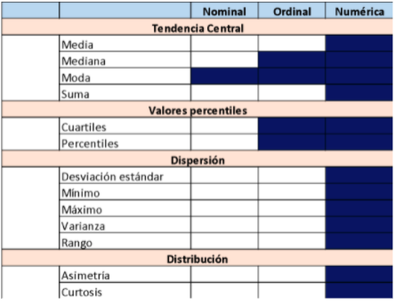
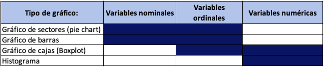

<br>

<<<<<<< HEAD
<center></center>

```{r,echo=FALSE, out.width="30%"}
knitr::include_graphics("logoPUCP.png") 
```

**FACULTAD DE CIENCIAS SOCIALES - PUCP**<br>

## Curso: POL 278 - Estadística para el análisis político 1 \| Semestre 2023 - 1 <br>

------------------------------------------------------------------------

## **Introducción a R**

<a id='beginning'></a>

Vamos a hablar de tres estructuras de datos en R:

1.  [¿Qué es R?](#part1)
2.  [¿Qué podemos hacer con R?](#part2)
3.  [Conceptos básicos para programar en R](#part3)
4.  [Vectores](#part4)
5.  [Data Frames](#part5)
6.  [Descriptivos](#part6)

------------------------------------------------------------------------

<a id='part1'></a>

## 1. ¿Qué es R?

R es un lenguaje de programación y un entorno de software libre y de código abierto utilizado para análisis estadístico y visualización de datos. Fue desarrollado por Ross Ihaka y Robert Gentleman en la Universidad de Auckland, Nueva Zelanda, en 1993. Desde entonces, ha sido ampliamente adoptado por la comunidad científica y empresarial como una herramienta esencial para el análisis y la visualización de datos.

R cuenta con una amplia variedad de paquetes y bibliotecas que permiten el análisis estadístico, la minería de datos, el aprendizaje automático, la visualización de datos y la generación de informes. Además, su sintaxis es relativamente sencilla, lo que facilita su aprendizaje y uso para personas con distintos niveles de experiencia en programación, lo cual ha significado su uso en diversos rubros.

```{r echo=FALSE}
library(vembedr)

embed_youtube("ZCQHm63xc4s")
```

------------------------------------------------------------------------

<a id='part2'></a>

## 2. ¿Qué podemos hacer con R?


------------------------------------------------------------------------

<a id='part3'></a>

## 3. Conceptos básicos para programar en R

Instalar [R](http://www.r-project.org)

Instalar [RStudio](https://posit.co/downloads/)

## Usando R


## Sintaxis en R


------------------------------------------------------------------------

------------------------------------------------------------------------

<a id='part3'></a>

## 3. Análisis descriptivo en R

```{r, results="hide"}
library(rio)    
data=import("Mosteller.csv") 
```

Esta base de datos pertenece al siguiente paper <https://pubmed.ncbi.nlm.nih.gov/8528684/> Mosteller (1995) realizó un estudio longitudinal sobre el impacto del tamaño de la clase en los primeros grados escolares, sobre el desempeño estudiantil y el desarrollo personal. Un estudio longitudinal es aquel en el que se hace un seguimiento a participantes a lo largo del tiempo. Este estudio en concreto duró de 1985 a 1989 y en él participaron 11.601 estudiantes. Durante los cuatro años del estudio, los estudiantes fueron asignados aleatoriamente a clases pequeñas, a clases de tamaño normal o a clases de tamaño normal con ayuda. Aunque el programa se detuvo en 1989 después de que la primera clase de jardín de infancia del programa terminara el tercer grado, la recopilación de información (por ejemplo, el rendimiento en los exámenes de octavo grado, el promedio general de la escuela secundaria) continuó hasta el final de la asistencia de los participantes a la escuela secundaria.

¿Por qué son importantes este tipo de estudios? Porque constituyen evidencia para los tomadores de decisión de política pública. Pensemos que esto puede contribuir a definir si la política educativa debe apostar por salones de clases con grupos pequeños o no, pensando en fortalecer las competencias de los estudiantes.

No obstante, para esta sesión no vamos a examinar las hipótesis o resultados del trabajo de Mosteller (1995), pero sí vamos a utilizar parte de su base de datos para el análisis descriptivo.

Exploramos las variables que tiene nuestra base de datos:

chr, factor, ordered factor, num, int

```{r}
names(data)
str(data)
```

El contenido de cada variable lo podemos ver en la siguiente tabla:

```{r,echo=FALSE, out.width="40%",fig.align="center"}
knitr::include_graphics("diccionario.png")
```

## 3.1. Configuración de las variables

Siempre antes de comenzar a realizar nuestro análisis, debemos identificar la estructura de las variables y verificar que estén bien "configuradas". Es decir que la escala de la variable coincida con el objeto en R.

**De "race"**

```{r}
table(data$race) #Exploramos frecuencias
class(data$race) #Exploramos el formato de la variable
data$race = factor(data$race, levels = c(1:6), labels = c("white","black","asian","hispanic","native american","others")) #Otorgamos formato
table(data$race)
class(data$race)
```

**De "classtype":**

```{r}
class(data$classtype) 
table(data$classtype)
data$classtype = factor(data$classtype, levels = c(1:3), labels = c("small","regular","regular with aid"))
str(data$classtype)
table(data$classtype)
```

**De "hsgrad"**

```{r}
class(data$hsgrad) 
table(data$hsgrad)
data$hsgrad = factor(data$hsgrad, levels = c(0:1), labels = c("did not graduate","did graduate")) #ojo con el orden
table(data$hsgrad) 
str(data$hsgrad)
```

**"g4math", "g4reading", "yearssmall"** son variables numéricas y están configuradas como vectores numéricos de números enteros (integer) por lo cual lo dejamos así.

## Media y mediana

Entonces, una vez configurados adecuadamente nuestros **objetos**, pidamos los estadísticos de tendencia central para nuestras variables.

Antes instalamos algunos paquetes que utilizaremos

-   **install.packages("DescTools")** para pedir los estadísticos de tendencia central

-   **install.packages("e1071")** para asimetría y curtosis

Las variables solicitadas son race, classtype y hsgrad

**Para "race" podemos:**

```{r}
#AÑADIR EJEMPLO
```

**Para "g4math" podemos:**

```{r}
library(DescTools)
mean(data$g4math) #este comando nos permitirá calcular la media
```

**Para "g4math" podemos:**

```{r}
library(DescTools)
median(data$g4math) #este comando nos permitirá calcular la mediana
```

------------------------------------------------------------------------

En la sesión anterior, revisamos la lógica de la sintaxis en R, así como algunos conceptos importantes para entender la manera en que funciona este lenguaje de programación estadístico: listas, vectores y data frames.

En esta sesión reforzaremos todo lo relacionado con el análisis descriptivo univariado de datos en R, junto con algunos ejercicios gráficos e introducción al lenguaje del paquete **ggplot2**, una librería muy usada para visualización de datos en este programa. ¡Empezamos!

## Recordando la sesión pasada:

En las sesiones previas hemos visto que hay este tipo de variables:

+-------------------------+-------------------------------------------------------------------------------------------------------------------------------------------------------------------------------------------------------------------------------------------------------------------------------------------+
| Tipo                    | Descripción                                                                                                                                                                                                                                                                               |
+=========================+===========================================================================================================================================================================================================================================================================================+
| **Variables nominales** | Género (Hombre=1, Mujer=2). Religión (Católico=1, Evangélico=2, Otro=3). Región (Lima=1, Arequipa=2, La Libertad =3).                                                                                                                                                                     |
|                         |                                                                                                                                                                                                                                                                                           |
|                         | Partido del presidente (Perú Libre=1, APP=2, PPC=3)                                                                                                                                                                                                                                       |
+-------------------------+-------------------------------------------------------------------------------------------------------------------------------------------------------------------------------------------------------------------------------------------------------------------------------------------+
| **Variables ordinales** | Educación (Analf=0, Prim=1, Sec=2, Tec=3, Univ=4, Post=5). Importancia de religión en su vida (Nada importante=1, Poco importante=2, Algo importante=3, Muy importante=4). Nivel de satisfacción con la democracia (Muy instafisfecho=1, Insatisfecho=2, Satisfecho=3, Muy satisfecho=4). |
+-------------------------+-------------------------------------------------------------------------------------------------------------------------------------------------------------------------------------------------------------------------------------------------------------------------------------------+
| **Variables continuas** | Estatura, peso, ingreso mensual,extensión, PBI per cápita, % de participación electoral.                                                                                                                                                                                                  |
+-------------------------+-------------------------------------------------------------------------------------------------------------------------------------------------------------------------------------------------------------------------------------------------------------------------------------------+
| **Variables discretas** | Número de hijos, edad, número de revocatorias, número de postas médicas, población.                                                                                                                                                                                                       |
+-------------------------+-------------------------------------------------------------------------------------------------------------------------------------------------------------------------------------------------------------------------------------------------------------------------------------------+

En R, las variables nominales se denominan **factores**, las variables ordinales como **factores ordinale**s y las variables continuas y discretas como **num**. En algunos casos, se puede encontrar lectura de variables como **int** (*interger*), que también son variables numéricas.

De forma similar, tenemos algunas medidas de tendencia central, de dispersión y de distribución de datos según el tipo de variable que nos encontramos analizando:

```{r, echo=FALSE, out.width="60%",fig.align="center"}

```

En línea con ello, también tenemos algunos gráficos según el tipo de variable de interés:

```{r, echo=FALSE, out.width="70%",fig.align="center"}


```

Hay una infinidad de gráficos a los que se puede recurrir dependiendo del interés de la investigadora o el investigador. Aquí hay algunos ejemplos útiles: <https://www.data-to-viz.com/>

¿Por qué es importante la visualización de datos? Graficar data ayuda a contar historias y, sobre todo, **dar un sentido** a los cientos, miles, o incluso millones de filas de datos que con las que podríamos eventualmente trabajar, facilitando la comprensión de la información.

En tanto la finalidad de la visualización de datos es ayudar a una mejor comprensión de la información, hay que tener cuidado con algunos gráficos como, por ejemplo, el gráfico de sectores o **pie chart**. A pesar de que la variable que estamos analizando permita utilizar este gráfico, hay buenas razones para no usarlo, y por qué es muchas veces mejor un gráfico de barras: <https://www.data-to-viz.com/caveat/pie.html>

## Análisis descriptivo y gráficos según tipo de variables:

Vamos a empezar con los análisis. Carguemos la data *fsi_democracy-index.xlsx*, del proyecto **Fragile State Index**. Esta base de datos se compone de doce indicadores de riesgo, que permiten medir la condición de diferentes Estados en un momento determinado del tiempo. Esto es de suma importancia, ya que de su fortaleza depende en gran medida el efectivo desarrollo de políticas públicas orientadas a la ciudadanía.

Más sobre la base y los indicadores por acá: <https://fragilestatesindex.org/indicators/>

```{r echo = T, results = 'hide',  fig.show='hide'}
library(rio) #Convocamos el paquete   
data=import("fsi_democracy-index.xlsx") 
str(data)
```

1.  Análisis de variables nominales:

A esta base de datos, sin embargo, se le ha incluido el índice de democracia, un indicador que da cuenta de las características del régimen político de cada país. Exploremos esta variable:

```{r echo = T, results = 'hide'}
#Esto debemos modificarlo:
class(data$Type)
table(data$Type)
```

¿Cómo está medida la variable?

Tal vez eso no es lo más recomendable para el análisis. Démosle el formato debido:

```{r echo = T, results = 'hide'}
data$Type = factor(data$Type, levels = c("Authoritarian regime", "Hybrid regime", "Flawed democracy", "Full democracy"))
str(data$Type)
```

Exploremos las frecuencias. Una forma de obtener las frecuencias de cada categoría, así como las frecuencias relativas porcentuales es con la función **table** :

```{r echo = T, results = 'hide'}
table(data$Type) #hacemos una tabla de frecuencia
prop.table(table(data$Type))*100
```

¡Hora de graficar! La comunidad de R ha creado muchos paquetes o librerías para visualizar datos de una forma más didáctica y atractiva. Un ejemplo de ello es **ggplot2**, una librería muy utilizada para visualizar datos. **ggplot2** tiene un lenguaje propio, y los códigos pueden resultar algo largos, pero es muy intuitivo y permite manipular mucho los resultados.

Más información sobre el lenguaje de **ggplot2**: <https://www.rstudio.com/wp-content/uploads/2015/04/ggplot2-spanish.pdf>

Llamemos la librería y veamos qué opciones tiene para analizar nuestra variable:

```{r echo = T, results = 'hide'}
grafico1 <- table(data$Type) #creamos un objeto que contenga la tabla de frecuencias dela variable

#Volvamos nuestro objeto un dataframe:
grafico1 = as.data.frame(grafico1)

#Para cambiar los nombres de las columnas: es un código frecuente para dar mayor orden a una base de datos
colnames(grafico1) = c("Reg","Freq")
```

```{r echo = T, results = 'hide',  fig.show='hide'}
library(ggplot2) #llamamos a ggplot2
ggplot(grafico1, aes(x="", y=Freq, fill=Reg)) + #Seleccionamos las variables
  geom_bar(stat="identity", width=1)+ #Agregando capas
  coord_polar("y", start=0) #Coordenadas cartesianas

#Para eliminar elementos innecesarios del gráfico:

ggplot(grafico1, aes(x="", y=Freq, fill=Reg)) +
  ggtitle("Índice de democracia") + #Agregamos el título
  geom_bar(stat="identity", width=1, color="white") +
  coord_polar("y", start=0) +
    theme_void() #Con esto quitamos los elementos no requeridos

#Podemos escoger los colores que consideramos:

pc=ggplot(grafico1, aes(x="", y=Freq, fill=Reg)) +
  ggtitle("Índice de democracia") + #Agregamos el título
  geom_bar(stat="identity", width=1, color="white") +
  coord_polar("y", start=0) +
  guides(fill=guide_legend(title="Régimen"))+ #añadimos título a la leyenda
  theme_void() #Con esto quitamos los elementos no requeridos

pc + scale_fill_manual(values=c("#999999", "#E69F00", "#56B4E9", "#00FF7F", "#008B8B","#D8BFD8")) #Pintamos y seleccionamos los colores manualmente


#Escogiendo una paleta en específico: aquí ya no escogemos los colores
pc + scale_fill_brewer(palette="Dark2")

```

### Más sobre personalizar nuestros gráficos

La ventaja de que R sea un software libre es que permite a la comunidad hacer cosas muy interesantes e innovadoras, hasta una paleta con colores de los albums de Taylor Swift para pintar nuestros gráficos!

Instalamos esto en R y llamamos a la librería "taylor"

remotes::install_github("wjakethompson/taylor")

Más información sobre esta librería por aquí: <https://taylor.wjakethompson.com/index.html>

```{r echo = T, results = 'hide',  fig.show='hide'}
library(taylor)
pc + scale_fill_taylor_d(album="red") 
```

Pero, de nuevo, mejor no usar pie charts. Veamos cómo trabajar con esta librería para hacer un gráfico de barras:

```{r echo = T, results = 'hide',  fig.show='hide'}
ggplot(grafico1, aes(x=Reg, y=Freq)) + 
  geom_bar(stat = "identity")
```

Demos formato a algunas cosas:

```{r echo = T, results = 'hide',  fig.show='hide'}
ggplot(grafico1, aes(x=reorder(Reg,Freq), y=Freq, fill=Reg)) + #Para ordenar el gráfico
  geom_bar(stat = "identity") +
    coord_flip() #Para voltearlo
   

ggplot(grafico1, aes(x=reorder(Reg,Freq), y=Freq, fill=Reg)) + #Para ordenar el gráfico
  geom_bar(stat = "identity") +
    coord_flip() + #Para voltear las barras
    labs(title="Índice de democracia", y="Frecuencias", x="Categorías")

ggplot(grafico1, aes(x=reorder(Reg,Freq), y=Freq, fill=Reg)) + #Para ordenar el gráfico
  geom_bar(stat = "identity") +
    coord_flip() + 
    labs(title="Índice de democracia", y="Frecuencias", x="Categorías")+
    theme(plot.title = element_text(hjust = 1)) + #Posición del título
    theme(panel.background=element_rect(fill = "white", colour = "white"))  #Fondo y contorno blanco
  
bp = ggplot(grafico1, aes(x=reorder(Reg,Freq), y=Freq, fill=Reg)) + 
  geom_bar(stat = "identity") +
    coord_flip() + 
    labs(title="Índice de democracia", y="Frecuencias", x="Categorías")+
    theme(plot.title = element_text(hjust = 1)) + 
    theme(panel.background=element_rect(fill = "white", colour = "white")) + 
    geom_text(aes(label=Freq), vjust=0.5, color="gray", size=5) #Frecuencias en las barras
   

bp + scale_fill_taylor_d(album="Lover") #Paleta de colores. Lover es un gran álbum!

```

En conclusión, la democracia plena no es algo que abunde en el mundo. Esta variable es de naturaleza ordinal. Las variables numéricas se tratan de la misma manera, pero no es necesario especificar los levels al momento de convertir la variable a factor.

2.  Análisis de variables numéricas

Ahora, veamos algunas medidas de tendencia central, distribución y dispersión para el caso de variables numéricas. Trabajemos con la variable *state legitimacy*, indicador que evalúa la representatividad y apertura del gobierno, y la manera como interactúa con la ciudadanía. Se toman en cuenta los niveles de confianza en las instituciones, demostraciones de desobediencia civil e insurgencias armadas.

Más información del indicador por acá: <https://fragilestatesindex.org/indicators/p1/>

Primero cambiemos los nombres de las variables. R funciona mejor así

```{r echo = T, results = 'hide',  fig.show='hide'}
names(data) #Para ver los nombres

colnames(data) = c("Country","Year","Rank","Score_Frag_States","Security","Elites","G_Grivance","Economy","Inequality","B_Drain","State_Legit","P_Services","Hum_Rights","Demo_Press","Refugees","Interven","Democracy_Score","Type")

class(data$State_Legit) #Esta bien medida!
```

Exploremos la variable. Veamos medidas de tendencia central. Ojo con cómo está medido: 10 es un Estado que posee un alto grado de ilegitimidad (o presión). 0 un Estado con poca presión o alta legitimidad desde la ciudadanía.

```{r echo = T, results = 'hide',  fig.show='hide'}
summary(data$State_Legit) #Ojo con los casos perdidos:
sd(data$State_Legit) 
var(data$State_Legit) #veamos la varianza
rango=max(data$State_Legit)-min(data$State_Legit)
rango
```

Veamos qué nos dicen los gráficos. Veamos qué cosas trae **ggplot2**. ¿Encontraremos diferentes según las características del régimen político? ¿Qué conclusiones podríamos sacar de estos gráficos?:

```{r echo = T, results = 'hide',  fig.show='hide'}
ggplot(data, aes(x="", y=State_Legit)) +  geom_boxplot()

ggplot(data, aes(x=Type, y=State_Legit)) +  geom_boxplot()
```

```{r echo = T, results = 'hide',  fig.show='hide'}
ggplot(data, aes(x=Type, y=State_Legit)) + 
  geom_boxplot() + coord_flip() #Volteamos el gráfico

ggplot(data, aes(x=Type, y=State_Legit, color =Type)) + #Damos color
  geom_boxplot() + coord_flip() #Volteamos el gráfico

ggplot(data, aes(x=Type, y=State_Legit, color =Type)) + 
  geom_boxplot() + coord_flip() + #Volteamos el gráfico
  theme(legend.position = "top")


ggplot(data, aes(x=Type, y=State_Legit, color =Type)) + 
  geom_boxplot() + coord_flip() + #Volteamos el gráfico
 
   theme(legend.position = "top", axis.text.y = element_blank(), 
        panel.background=element_rect(fill = "white", colour = "white")) + #Quitamos categorías
  
  geom_jitter(shape=16, position=position_jitter(0.2)) + #Agregamos los casos como puntos
  
  labs(title = "Legitimidad estatal según el tipo de régimen político", x="", y="Index")

```

Finalmente, también podemos sacar un histograma para visualizar estos datos. Utilicemos **ggplot2** para agregar más detalles al gráfico como en los casos previos:

```{r echo = T, results = 'hide',  fig.show='hide'}
ggplot(data, aes(x=State_Legit)) + 
  geom_histogram()

ggplot(data, aes(x=State_Legit)) + 
  geom_histogram() + 
    labs(title="Legitimidad estatal", y="Conteo", x="Score")+
    theme(plot.title = element_text(hjust = 0.5)) + 
    theme(panel.background=element_rect(fill = "white", colour = "white")) +
    geom_vline(aes(xintercept=mean(State_Legit, na.rm = T)),
            color="blue", linetype="dashed", size=1)

ggplot(data, aes(x=State_Legit, color = Type)) + 
  geom_histogram(fill="white",alpha=0.5, position="identity") + 
    labs(title="Legitimidad estatal", y="Conteo", x="IMC")+
    theme(plot.title = element_text(hjust = 0.5)) + 
    theme(panel.background=element_rect(fill = "white", colour = "white"))
  #scale_color_brewer(palette="Pastel2")

```

Pueden conocer más sobre cómo editar y personalizar sus gráficos en el siguiente enlace: <https://r-charts.com/es/ggplot2/>

***Ejercicios***

-   Seleccione dos variables y realice un boxplot. Justifique su elección de variables y analice los resultados.

<br></br> [Go to page beginning](#beginning) [Go to page beginning](#beginning)
=======
En este documento veremos los códigos pertenecientes a la primera semana práctica del curso de Estadística I

```{r}

```

esto es una prueba

>>>>>>> a7737d46809a6eb45532c7202e0bc0478153aef0
