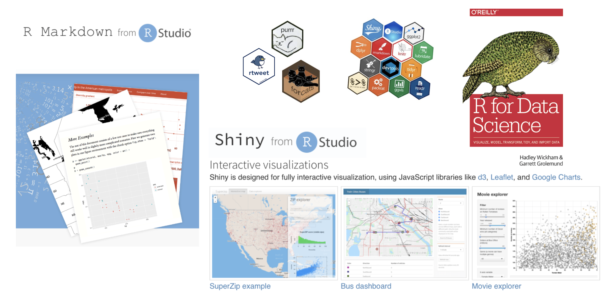
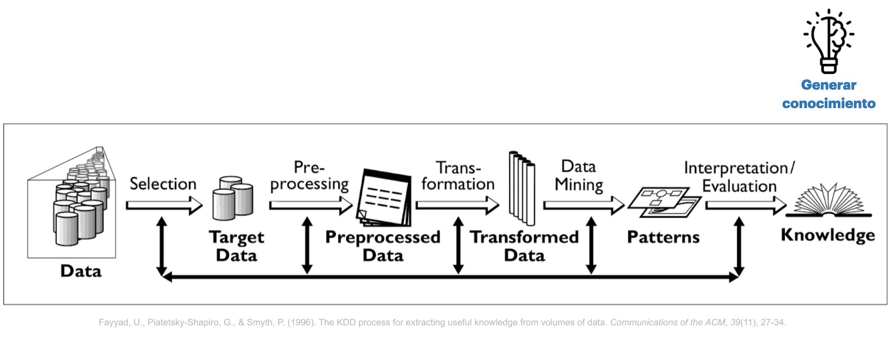

<center></center>

```{r,echo=FALSE, out.width="30%"}
knitr::include_graphics("logoPUCP.png") 
```

**FACULTAD DE CIENCIAS SOCIALES - PUCP**<br>

## Curso: POL 278 - Estadística para el análisis político 1 \| Semestre 2023 - 2 <br>

------------------------------------------------------------------------

## **Introducción a R**

<a id='beginning'></a>

<a id='part1'></a>

# **1. ¿Qué es R?**

R es un lenguaje de programación y un entorno de software libre y de código abierto utilizado para análisis estadístico y visualización de datos. Fue desarrollado por Ross Ihaka y Robert Gentleman en la Universidad de Auckland, Nueva Zelanda, en 1993. Desde entonces, ha sido ampliamente adoptado por la comunidad científica y empresarial como una herramienta esencial para el análisis y la visualización de datos.

R cuenta con una amplia variedad de paquetes y bibliotecas que permiten el análisis estadístico, la minería de datos, el aprendizaje automático, la visualización de datos y la generación de informes. Además, su sintaxis es relativamente sencilla, lo que facilita su aprendizaje y uso para personas con distintos niveles de experiencia en programación, lo cual ha significado su uso en diversos rubros.

```{r echo=FALSE}
library(vembedr)

embed_youtube("ZCQHm63xc4s")
```

------------------------------------------------------------------------

<a id='part2'></a>

# **2. ¿Qué podemos hacer con R?**







------------------------------------------------------------------------

<a id='part3'></a>

# **3. Conceptos básicos para programar en R**

Instalar [R](http://www.r-project.org)

Instalar [RStudio](https://posit.co/downloads/)

### Usando R


#### **3.1. Configurar el directorio de trabajo**

R funciona como un entorno temporal de trabajo, lo que quiere decir que el usuario va agregando datos y objetos. Sin embargo, si los análisis no son guardados se deberán repetir las instrucciones para obtener otra vez el resultado. Por esta razón, es preciso configurar una carpeta predeterminada en nuestro ordenador, donde el programa buscará los archivos a ejecutar y guardará los archivos a conservar con cambios.

Para ver nuestro lugar de trabajo actual escribimos el siguiente comando (escriba el código en la consola, ya que si lo ejecuta desde este Rmd, obtendrá el lugar donde se encuentra este archivo):

```{r}
getwd() #para saber en qué carpeta está el archivo
```

Si queremos cambiar de directorio de trabajo, nos dirigirnos al menú **"Session" \> "Set Working Directory" \> "Choose Directory"**. Esto abrirá una ventana emergente, donde buscaremos la carpeta en la cual vamos a trabajar, la ubicamos y seleccionamos "Open". Para verificar el cambio volvemos a digitar la función **"getwd()"** en la consola.

#### **3.2. Sintaxis y objetos en R**

El uso de R es bastante intuitivo y sigue un patrón lógico. Está compuesto de códigos y la combinación de estos códigos genera una sintaxis. Asimismo, R guarda la información de nuestras observaciones y variables a través de objetos.

En un sentido global, la estructura general de una sintaxis puede resumirse como sigue: a un objeto dado se le asigna el resultado de una función, que a su vez se ejecuta sobre un conjunto de datos especificado, con una serie de configuraciones particulares. Veamos el siguiente ejemplo ficticio.


Si se lee de izquierda a derecha, la línea de comando puede explicarse como sigue:

-   Primero se indica un objeto a crear, con el nombre que ustedes definan.

-   Luego se indica el asignador, que expresa que todo lo que esté a la derecha de la flecha se guardará en el objeto creado a la izquierda. El asignador puede ser "\<-" o también "=", para motivos del curso usaremos este último.

-   Luego viene la función que en este caso permite leer archivos tipo Microsoft Excel. R trabaja con funciones que están dentro de "paquetes" que la comunidad va desarrollando. Podemos hacer nuestras operaciones con diversas funciones, y no hay una sola forma de hacerlo. Si se trata de funciones que no están predeterminadas en R, debemos instalar el paquete que las contiene con el comando "install.packages()", y antes de ejecutarla debemos abrir la libreria con el comando "library()"

-   Luego de la función, se abre un paréntesis que contiene los argumentos: instrucciones que especifican ciertos detalles de lo que queramos que la función realice. Los argumentos pueden escribirse de distintas maneras y va a depender de lo que queramos hacer. En nuestro ejemplo: El primer argumento indica la información a leer, en este caso indica un archivo de tipo Excel (extensión xlsx). El segundo argumento indica la hoja del archivo a leer. El tercer argumento indica qué columnas se leerán de forma específica (en este caso, las primeras diez).

**Hagamos un ejemplo:**

Vamos a abrir un archivo en R, utilizando la función "import" del paquete "rio", el cual es un paquete versátil que nos permite importar datos de diversas extensiones (dta, sav, csv, xls, etc.)

Antes que todo, debemos instalar el paquete escribiendo en la consola: install.packages("rio")

```{r}
library(rio) #Convocamos el paquete   
data=import("Mosteller.csv") #Utilizamos la función import (importar) que creará un objeto en R que contenga la base de datos del archivo "Mosteller.csv" que hemos descargado. Podemos verificar la creación en el environment (ventana derecha superior)

class(data) #si quieren saber que clase de objeto es el que has creado, utilizamos la función "class" y entre paréntesis colocamos el nombre del objeto. Verán que se trata de un "data frame", es el tipo de objeto en R para las bases de datos.
```

¿Qué otro tipo de objetos existen?

#### **3.3. Tipos de objetos en R**

Una parte clave para iniciar el manejo del programa es identificar los diversos objetos que podemos crear, manipular y utilizar. Para la definición de objetos en R será necesario previamente tener claridad teórica sobre lo que es una variable categórica nominal, categórica ordinal, numérica discreta y numérica continua.

Para los fines de este curso se contemplarán las siguientes objetos:

+------------------------+----------------------------------------------------------------------------------------------------------------------------------------+
| Tipo                   | Descripción                                                                                                                            |
+========================+========================================================================================================================================+
| **Vector numérico**    | Vector conformado por la concatenación de números, puede representar variables numéricas continuas o discretas. Ej: 1.5 , 2.7 , 3.1    |
+------------------------+----------------------------------------------------------------------------------------------------------------------------------------+
| **Vector de factores** | Vector que sirve para representar variables categóricas.                                                                               |
|                        |                                                                                                                                        |
|                        | Pudiendo ser factores nominales u ordinales. Ej: "costa", "sierra", "selva"                                                            |
+------------------------+----------------------------------------------------------------------------------------------------------------------------------------+
| **Data frames**        | Son hojas de datos, estructuras similares a una matriz; sin embargo, a diferencia de estas pueden almacenar objetos de distintos tipo. |
|                        |                                                                                                                                        |
|                        | **Generalmente nuestras bases de datos son de este tipo** (como una hoja de Excel que tiene variables numéricas, categóricas, etc).    |
+------------------------+----------------------------------------------------------------------------------------------------------------------------------------+

Los **vectores numéricos** se crean a través de la función **concatenar "c()"**. Vamos a crear un vector que contenga los montos en millones de soles del presupuesto del Estado asignado a las 5 prioridades para el 2021

```{r}
Presupuesto_millones=c(9879, 33132, 20991, 690, 5392) #creamos el vector (verifiquemos en el environment)
Presupuesto_millones #invocamos el vector para visualizar su contenido
```

Un **factor** nos permite representar una variable categórica. Se crean a través de la función **"factor()"**, pero antes se crea como vector pues almacena las categorías en la forma de un vector con números discretos integrales (1,2,3,4,etc.), que son códigos de los valores de la variable y otro vector de caracteres interno que contiene las etiquetas de esos códigos. Creemos un factor con los nombres de las prioridades del presupuesto para el 2021:

```{r}
Prioridad = c(1,2,3,4,5) #primero creamos un vector
Prioridad = factor(Prioridad, levels = c(1:5), labels = c("reactivación", "educación","salud","mujer","pobreza")) #Lo convertimos en factor. Ojo con los argumentos.
Prioridad #visualizamos su contenido
```

También podemos crear un **factor ordenado** para almacenar información de una variable categórica ordinal. Es casi la misma ruta, solo que añadiremos una función más para convertir el factor en ordinal. Creemos un factor ordinal ficticio que contenga el nivel de ejecución que el Estado ha mostrado en las categorías presupuestales correspondientes a las prioridades, donde 1=Mala, 2=Intermedia y 3= Buena.

```{r}
Ejecucion=c(3,2,2,1,2) #creamos un vector numérico que registra los datos
Ejecucion=factor(Ejecucion) #Lo convertimos en factor
levels(Ejecucion)=c("Mala","Intermedia","Buena") #asignamos los niveles al factor
Ejecucion=ordered(Ejecucion) #indicamos que se trata de un factor ordinal
Ejecucion #Visualizamos
```

Finalmente, los **data frames** nos permite almacenar un conjunto de datos, es decir una base de datos (bbdd) que tiene filas y columnas. Creemos la base de datos "PP2021" que contenga todos los objetos que hemos creado:

```{r}
PP2023 = data.frame(Prioridad,Presupuesto_millones,Ejecucion)
PP2023 # Visualice la base de datos
str(PP2023) # Visualice la estructura de la BD
names(PP2023) #Visualice los nombres de las variables de la BD
```

Cuando queramos invocar una variable específica de una base de datos utilizaremos **"\$"**, entre la base de datos y la variable que queremos invocar.

```{r}
PP2023$Prioridad #invocamos la variable prioridad de la base de datos
class(PP2023$Ejecucion) #vemos de que clase es la variable ejecución de la bbdd
```

------------------------------------------------------------------------

<a id='part4'></a>

# **4. Análisis descriptivo en R**

```{r, results="hide"}
library(rio)    
data=import("Mosteller.csv") 
```

Esta base de datos pertenece al siguiente paper <https://pubmed.ncbi.nlm.nih.gov/8528684/> Mosteller (1995) realizó un estudio longitudinal sobre el impacto del tamaño de la clase en los primeros grados escolares, sobre el desempeño estudiantil y el desarrollo personal. Un estudio longitudinal es aquel en el que se hace un seguimiento a participantes a lo largo del tiempo. Este estudio en concreto duró de 1985 a 1989 y en él participaron 11.601 estudiantes. Durante los cuatro años del estudio, los estudiantes fueron asignados aleatoriamente a clases pequeñas, a clases de tamaño normal o a clases de tamaño normal con ayuda. Aunque el programa se detuvo en 1989 después de que la primera clase de jardín de infancia del programa terminara el tercer grado, la recopilación de información (por ejemplo, el rendimiento en los exámenes de octavo grado, el promedio general de la escuela secundaria) continuó hasta el final de la asistencia de los participantes a la escuela secundaria.

¿Por qué son importantes este tipo de estudios? Porque constituyen evidencia para los tomadores de decisión de política pública.

No obstante, para esta sesión no vamos a examinar las hipótesis o resultados del trabajo de Mosteller (1995), pero sí vamos a utilizar parte de su base de datos para el análisis descriptivo.

Exploramos las variables que tiene nuestra base de datos:

chr, factor, ordered factor, num, int

chr, factor -> variable nominal
ordered factor -> variable ordinal
num, int -> variable numérica

```{r}
names(data)
str(data)
```

El contenido de cada variable lo podemos ver en la siguiente tabla:

```{r,echo=FALSE, out.width="40%",fig.align="center"}
knitr::include_graphics("diccionario.png")
```

#### **4.1. Configuración de las variables**

Siempre antes de comenzar a realizar nuestro análisis, debemos identificar la estructura de las variables y verificar que estén bien "configuradas". Es decir que la escala de la variable coincida con el objeto en R.

Por ejemplo, debemos asegurarnos que una variable categórica no esté configurada como numérica en R, y viceversa.

**De "race"**

```{r}
table(data$race) #Exploramos frecuencias
class(data$race) #Exploramos el formato de la variable
data$race = factor(data$race, levels = c(1:6), labels = c("white","black","asian","hispanic","native american","others")) #Otorgamos formato
table(data$race)
class(data$race)
```

**De "classtype":**

```{r}
class(data$classtype) 
table(data$classtype)
data$classtype = factor(data$classtype, levels = c(1:3), labels = c("small","regular","regular with aid"))
str(data$classtype)
table(data$classtype)
```

**De "hsgrad"**

```{r}
class(data$hsgrad) 
table(data$hsgrad)
data$hsgrad = factor(data$hsgrad, levels = c(0:1), labels = c("did not graduate","did graduate")) #ojo con el orden
table(data$hsgrad) 
str(data$hsgrad)
```

**"g4math", "g4reading", "yearssmall"** son variables numéricas y están configuradas como vectores numéricos de números enteros (integer), por lo cual lo dejamos así.

#### 4.2 Media y mediana

Entonces, una vez configurados adecuadamente nuestros **objetos**, pidamos los estadísticos de tendencia central para nuestras variables.

Antes instalamos algunos paquetes que utilizaremos

-   **install.packages("DescTools")** para pedir los estadísticos de tendencia central

Las variables solicitadas son classtype y hsgrad

**Para "g4math" podemos:**

```{r}
library(DescTools)
library(tidyverse)

data %>% summarise(media = mean(g4math)) #este comando nos permitirá calcular la media. Consejo: leer este comando de derecha a izquierda
```

**Para "g4math" podemos:**

```{r}
library(DescTools)
data %>% summarise(mediana = median(g4math)) #calcular la mediana. Al igual que con la media, se sugiere leer el comando de derecha a izquierda.
```

------------------------------------------------------------------------

### Ejercicio: Calculemos la media y la mediana de la variable "g4reading"

<br></br> [Go to page beginning](#beginning)
