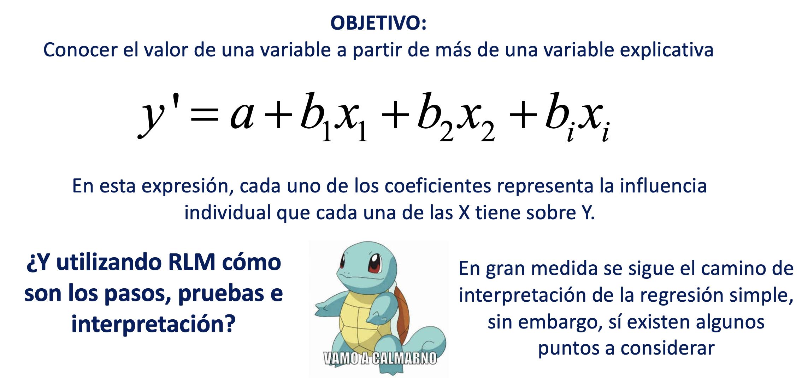
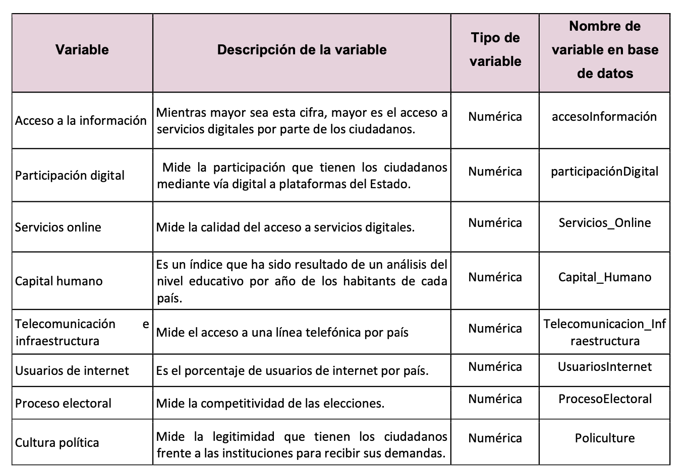

<center></center>

```{r,echo=FALSE, out.width="30%"}
knitr::include_graphics("logoPUCP.png") 
```

**FACULTAD DE CIENCIAS SOCIALES - PUCP**<br>

## Curso: POL 278 - Estadística para el análisis político 1 \| Semestre 2023 - 1 <br>

------------------------------------------------------------------------

# **Regresión linea múltiple**
_Recordando lo avanzado_

```{r,echo=FALSE, out.width="100%",fig.align="center"}
 
```


**Digital Access Index** 😎

El Índice de Acceso Digital (Digital Access Index, DAI) es un indicador utilizado para medir y evaluar el nivel de acceso a las tecnologías digitales y a Internet en un país o región. Proporciona una medida de hasta qué punto las personas y las comunidades pueden utilizar y beneficiarse de las tecnologías digitales.

El DAI tiene en cuenta diversos factores que contribuyen al acceso digital, como la disponibilidad de infraestructura, la asequibilidad de los servicios de Internet, los niveles de educación y las tasas de uso de Internet. Al analizar estos componentes, el índice tiene como objetivo evaluar la preparación digital y la inclusión digital en una determinada área.

El DAI es una herramienta útil para los responsables de políticas, investigadores y organizaciones para comprender el estado del acceso digital e identificar áreas que necesitan mejorar. Puede ayudar a orientar los esfuerzos para reducir la brecha digital y garantizar que todas las personas tengan igualdad de oportunidades para beneficiarse de las tecnologías digitales.

**Egov-index**

El Índice de Gobierno Electrónico (e-Government Index) es una medida que evalúa el nivel de desarrollo y adopción de tecnologías de la información y la comunicación (TIC) en el sector público de un país. Este índice se utiliza para medir y comparar la capacidad de los gobiernos para proporcionar servicios en línea, promover la participación ciudadana y utilizar las TIC de manera efectiva en la gestión gubernamental.

El Índice de Gobierno Electrónico suele ser elaborado por organismos internacionales, como la Organización de las Naciones Unidas (ONU) y su Departamento de Asuntos Económicos y Sociales (UNDESA), o el Banco Mundial. Cada organismo puede tener su propio método y conjunto de indicadores para calcular el índice.

**Democracy Index**

El Índice de Democracia es un índice que mide el estado de la democracia en países de todo el mundo. Es elaborado por la Unidad de Inteligencia de The Economist (EIU), una firma independiente de investigación y análisis. El índice evalúa el funcionamiento de los procesos e instituciones democráticas en cada país en base a una serie de indicadores.

```{r,echo=FALSE, out.width="60%",fig.align="center"}
 
```

```{r}
library(rio)
Egov=import("Egov.xlsx")
```

```{r}
names(Egov)
```

```{r}
library(dplyr)
library(ggplot2)

modelo1 = lm(accesoInformacion ~participaciónDigital+Servicios_Online+Capital_Humano  +Telecommunicacion_Infrastructura+ProcesoElectoral+ Policulture +UsuariosInternet   ,data=Egov)
summary(modelo1)
```

