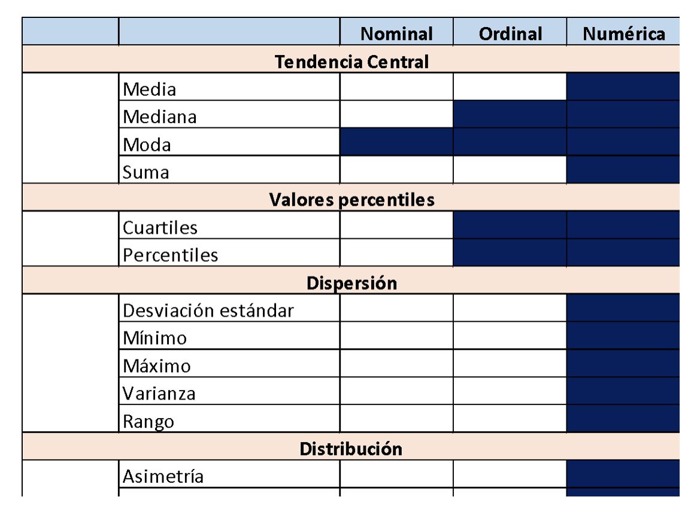

<center></center>

```{r,echo=FALSE, out.width="30%"}
knitr::include_graphics("logoPUCP.png") 
```

**FACULTAD DE CIENCIAS SOCIALES - PUCP**<br>

## Curso: POL 278 - Estadística para el análisis político 1 \| Semestre 2023 - 2 <br>

------------------------------------------------------------------------

# **1.¿Qué es el análisis descriptivo?**

```{r,echo=FALSE, out.width="80%",fig.align="center"}
knitr::include_graphics("pd2_QSAnalisisDesc.png") 
```

# **2.Nivel de medida de una variable**

```{r,echo=FALSE, out.width="50%",fig.align="center"}
knitr::include_graphics("pd2_medVar.png") 
```

### **Medición por tipo de variables:**

CAMBIAR FORMA DE TABLA LIZ

```{r,echo=FALSE, out.width="50%",fig.align="center"}
 
```

# **3.Importancia de visualización de datos**

Hay una infinidad de gráficos a los que se puede recurrir dependiendo del interés de la investigadora o el investigador. Aquí hay algunos ejemplos útiles: <https://www.data-to-viz.com/>

> ¿Por qué es importante la visualización de datos?

Graficar data ayuda a contar historias y, sobre todo, *dar un sentido* a los cientos, miles, o incluso millones, de filas de datos que con las que podríamos eventualmente trabajar, facilitando la comprensión de la información.

En tanto la finalidad de la visualización de datos es ayudar a una mejor comprensión de la información, hay que tener cuidado con algunos gráficos como, por ejemplo, el gráfico de sectores o *pie chart*. A pesar de que la variable que estamos analizando permita utilizar este gráfico, hay buenas razones para no usarlo, y por qué es muchas veces mejor un gráfico de barras: <https://www.data-to-viz.com/caveat/pie.html>

```{r,echo=FALSE, out.width="90%",fig.align="center"}
knitr::include_graphics("pd2_datavis.png") 
```

### **Gráficos por tipo de variables:**

```{r,echo=FALSE, out.width="60%",fig.align="center"}
knitr::include_graphics("pd2_GrafTipoVar.png") 
```

# **4.Análisis descriptivo**

Carguemos la data *Enades_subset.dta*.

Hoy trabajaremos con algunas de las variables que forman parte de la Encuesta Nacional de Percepción de Desigualdades - ENADES 2022, que fue elaborada por Instituto de Estudios Peruanos (IEP) y Oxfam. Como lo dice su nombre, esta encuesta busca ahondar en la percepción de las diferentes formas de desigualdad en el Perú e incorpora indicadores que permiten medir la magnitud de brechas sociales y políticas como género, clase, etc.

```{r,echo=FALSE, out.width="100%",fig.align="center"}
knitr::include_graphics("Diccionario-enades.png") 
```

```{r,warning=FALSE}
library(rio) #Convocamos el paquete   
data=import("Enades_subset.dta") 

str(data)
```

```{r}
names(data) #revisamos los nombres
```

### **Análisis de una variable ordinal**

```{r,warning=FALSE}
library(dplyr)
```

```{r}
#comprobamos el tipo de dato que analizaremos
class(data$p04)
```

Del diccionario de datos, sabemos que esta variable es una ordinal, revisemos los niveles antes de categorizarla correctamente.

```{r}
table(data$p04) #Veamos los niveles de la variable
```

Otorguemosle etiquetas y categorizemosla como factor:

```{r}
data$p04 = factor(data$p04, levels = c(1:4), labels = c("Mucho","Algo","Poco","Nada"),ordered = TRUE)
```

Revisemos que el cambio se haya realizado correctamente correctamente. Para hacerlo, nuevamente Para hacerlo tenemos dos formas, 1. comando table (que revisamos anteriormente), y 2. commando summarize/summarise de dplyr

```{r}
data %>%
 group_by(p04) %>%
  summarize(Freq=n())
```

A primera vista, la tabla nos indica que la mayoría de los encuestados (868) opina que hay mucha desigualdad económica en el país. Pero, ¿cuánto sería eso en porcentaje?

Podemos realizar una tabla de frecuencias y porcentajes agregando una linea al comando anterior. Para poder graficar los resultados de las tablas, tendremos que almacenarlas en un objeto. Trabajemos con esta tabla resumen, asignemosle el nombre de *para_grafico* para así luego llamarla al graficar.

```{r}
para_grafico=data %>%
 group_by(p04) %>%
  summarize(Freq=n()) %>%
   mutate(Porcentaje = (Freq / sum(Freq))*100)
```

Afirmamos que más del 50% de los encuestados percibe que el país es muy desigual económicamente.

Podemos analizar cómo cambia esto si solo seleccionamos los casos de los encuestados/as menores de 30 años.

```{r}
data %>%
  filter(edad<30)%>%
  group_by(p04) %>%
  summarize(Freq=n()) %>%
  mutate(Porcentaje = (Freq / sum(Freq))*100)
```

Grafiquemos los resultados con *ggplot2*

Nuestra variable es categórica, por lo tanto realizaremos el gráfico acorde:

```{r}
library(ggplot2)
library(taylor) #opcional (una ventaja de que R sea software libre)

ggplot(para_grafico, aes(x=p04, y=Porcentaje, fill=p04)) + 
geom_bar(stat = "identity") 
```

Este es un gráfico básico, pero podemos personalizarlo según nuestros gustos.

```{r}

ggplot(para_grafico, aes(x=p04, y=Porcentaje, fill=p04)) + 
  geom_bar(stat = "identity")  +
  ggtitle("Percepción de desigualdad económica") +
  xlab("¿Qué tan desigual cree que\n es el Perú económicamente") + ylab("Porcentaje")+
  geom_text(aes(label=round(Porcentaje,1)), vjust=1.30, color="black", size=3)+
  theme(panel.background=element_rect(fill = "white", colour = "white")) +
  #scale_fill_brewer(palette="Dark2")
  scale_fill_taylor_d(album="Lover") #"Fearless (Taylor's Version)"

```

El ejercicio de análisis descriptivo con variables numéricas lo realizaremos con un indicador aditivo que crearemos a continuación.

### **Indicador Proxy**

También llamado indicador indirecto, se usa ante la imposibilidad de medir lo que efectivamente es de importancia. El indicador mide una variable distinta a la que nos interesa de manera específica, pero presenta una relación lo más directa posible con el fenómeno en estudio.

Un indicador proxy es una medición o señal indirecto que aproxima o representa un fenómeno en la ausencia de una medición o señal directo.

Por ejemplo, el número de miembros femeninos de una cámara de comercio podría ser un indicador proxy para el porcentaje de dueñas de negocios o ejecutivas.

## **Indicador Aditivo**

### **Pasos para construir un indicador:**

1.  Verificar que las variables que construyan el indicador correspondan al concepto que se desea medir. *Ejemplo: Si deseo mejor Satisfacción del Usuario, las preguntas deben ser sobre ello.*
2.  Revisar el cuestionario e identificar el sentido de las categorías. *Ejemplo: El valor 5 es "Muy instafisfecho" y 1 "Muy satisfecho"*
3.  Si las categorías de las variables están en el correcto sentido proceder a sumarlas, si no lo están, proceder a recodificarlas para luego sumar.
4.  Una vez realizada la suma, identificar el mínimo y el máximo.
5.  Restar a todos los valores el valor mínimo.
6.  Al resultado de lo anterior, dividir por el nuevo máximo menos el mínimo, con ello, se va a obtener valores entre 0 y 1.
7.  Multiplicar por 100 si se desea el índice de 0 a 100, o por 10 si se desea el índice de 0 a 10.

Construiremos un indicador aditivos de percepción de desigualdad en el acceso a servicios y derechos en el Perú, que vaya del 0 al 100. Para ello usaremos a las variables p11_1,p11_2,p11_3 y p11_4. Estas variables responden a la pregunta de qué tan desigual es el acceso a la eduación, salud, trabajo y justicia; siendo 1-muy desigual y 3- nada desigual. El indicador que queremos crear es de percepción de desigualdad, por tanto el mayor valor debería ser mayor desigualdad. Las variables modificadas se llaman d_educ, d_salud, d_trabajo y d_justicia.

Para poder crear el indicador, necesitamos que todas las variables a usar sean numéricas porque las tendremos que sumar.

```{r}
str(data)#Podemos notar que las variables que usaremos son de tipo caracter.
```

Recategorizemos nuestras variables a numéricas:

```{r}
names(data)
data[7:10] = lapply(data[7:10],as.numeric) #podemos usar lapply para recodificar más de una variable a la vez
```

Recordemos los pasos para crear un índice aditivo:

```         
*((var_suma - mín_de_suma)/(máx_de_suma-mín de suma)))\*valor al que quiere que llegue el índice(si va del 0 al 10 será 10, del 0 al 50 será 50, etc).*
```

```{r}
data=data %>%
  mutate(suma = d_educ + d_salud + d_trabajo + d_justicia)

```

Revisamos mínimo y máximo

```{r}
summary(data$suma)
```

```{r}
data = data %>%
 mutate(indicador = ((suma-4)/(12-4))*100) #Como queremos que el indicador vaya del 0 al 10, lo multiplicamos por 10 
```

### Análisis de variables numéricas

Ahora, veamos algunas medidas de tendencia central, distribución y dispersión para el caso de variables numéricas. Trabajaremos con el indicador que acabamos de crear

Exploremos la variable. Veamos medidas de tendencia central y de dispersión. Recordemos que va del 0 al 100.

```{r}
data%>%
  summarise(Media = mean(indicador), 
            Mediana = median(indicador),
            Desviacion = sd(indicador),
            Minimo = min(indicador),
            Maximo = max(indicador))
```

Podemos analizar la respuesta según el sexo de los encuestados

```{r}
data$sexo = factor(data$sexo, levels = c(1:2), labels = c("Hombre","Mujer"))
```

```{r}
data %>%
 group_by(sexo) %>%
  summarize(Media=mean(indicador)) 
```

La tabla nos indica que las encuestadas mujeres perciben ligeramente una mayor desigualdad en los derechos y servicios, a comparación de los hombres.

Podemos visualizarlo mejor con un gráfico

```{r}
ggplot(data, aes(x=sexo, y=indicador, color=sexo)) + 
  geom_boxplot() + 
  geom_jitter(shape=16, position=position_jitter(0.2)) +#para agregar los casos como puntos
  theme_classic()

```

**Ejercicio:** Analice descriptivos y elabore el gráfico correspondiente para la variable p03_1
