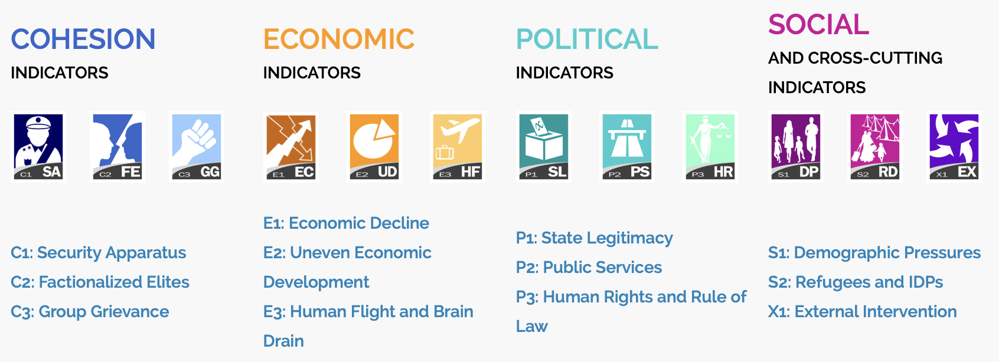

<center></center>

```{r,echo=FALSE, out.width="30%"}
knitr::include_graphics("logoPUCP.png") 
```

**FACULTAD DE CIENCIAS SOCIALES - PUCP**<br>

## Curso: POL 278 - Estadística para el análisis político 1 \| Semestre 2023 - 1 <br>

------------------------------------------------------------------------

# **1.¿Qué es el análisis descriptivo?**

```{r,echo=FALSE, out.width="80%",fig.align="center"}
knitr::include_graphics("pd2_QSAnalisisDesc.png") 
```

# **2.Nivel de medida de una variable**

```{r,echo=FALSE, out.width="50%",fig.align="center"}
knitr::include_graphics("pd2_medVar.png") 
```

### **Medición por tipo de variables:**

```{r,echo=FALSE, out.width="50%",fig.align="center"}
knitr::include_graphics("pd2_MedTipoVar.png") 
```

# **3.Importancia de visualización de datos**

Hay una infinidad de gráficos a los que se puede recurrir dependiendo del interés de la investigadora o el investigador. Aquí hay algunos ejemplos útiles: <https://www.data-to-viz.com/>

¿Por qué es importante la visualización de datos? Graficar data ayuda a contar historias y, sobre todo, *dar un sentido* a los cientos, miles, o incluso millones, de filas de datos que con las que podríamos eventualmente trabajar, facilitando la comprensión de la información.

En tanto la finalidad de la visualización de datos es ayudar a una mejor comprensión de la información, hay que tener cuidado con algunos gráficos como, por ejemplo, el gráfico de sectores o *pie chart*. A pesar de que la variable que estamos analizando permita utilizar este gráfico, hay buenas razones para no usarlo, y por qué es muchas veces mejor un gráfico de barras: <https://www.data-to-viz.com/caveat/pie.html>

```{r,echo=FALSE, out.width="90%",fig.align="center"}
knitr::include_graphics("pd2_datavis.png") 
```

### **Gráficos por tipo de variables:**

```{r,echo=FALSE, out.width="60%",fig.align="center"}
knitr::include_graphics("pd2_GrafTipoVar.png") 
```

# **4.Análisis descriptivo**

Carguemos la data *state_democracy_final.xlsx*.

Hoy trabajaremos con el Índice de Estados Frágiles 2021 (Fragile State Index) la cual es una herramienta analítica desarrollada por The Fund for Peace y publicada anualmente en colaboración con Foreign Policy Magazine. El índice mide la fragilidad de los Estados y su capacidad para proporcionar servicios básicos a sus ciudadanos, mantener el control del territorio y la seguridad interna, así como su capacidad para interactuar efectivamente con otros Estados y actores internacionales. La fragilidad del Estado se mide a través de varios indicadores, incluyendo conflictos étnicos y religiosos, violencia, desplazamiento de población, desigualdad, pobreza, corrupción y falta de Estado de derecho. El índice es utilizado por gobiernos, organizaciones internacionales y expertos para comprender mejor la dinámica de los Estados frágiles y desarrollar políticas y estrategias para abordar sus desafíos.

```{r,echo=FALSE, out.width="100%",fig.align="center"}
 
```

Adicionalmente a la información recogida del Índice de Estados Frágiles, se le ha añadido los resultados del Democracy index. El índice de democracia (Democracy Index) es una herramienta analítica desarrollada por The Economist Intelligence Unit (EIU) que mide el nivel de democracia en 167 países del mundo. El índice se basa en cinco categorías principales: proceso electoral y pluralismo, funcionamiento del gobierno, participación política, cultura política y derechos civiles. Cada categoría se desglosa en subcategorías y se otorga una puntuación a cada país en función de su desempeño en cada una de ellas. *La puntuación final de un país se clasifica en una de las cuatro categorías generales: democracia plena, democracia imperfecta, régimen híbrido o régimen autoritario*. El índice se utiliza para evaluar y comparar el nivel de democracia en diferentes países y se actualiza anualmente para reflejar los cambios políticos y sociales.

```{r}
library(rio) #Convocamos el paquete   
data=import("state_democracy_final.xlsx") 
str(data)
```

```{r}
names(data) #revisamos los nombres
```
Renombramos las variables
```{r}
colnames(data) = c("Country","Year","Rank","Score_Frag_States","Security","Elites","G_Grivance","Economy","Inequality","B_Drain","State_Legit","P_Services","Hum_Rights","Demo_Press","Refugees","Interven","Democracy_Score","Type")
```

## **Análisis de una variable ordinal**

```{r}
library(dplyr)
library(tidyverse)
```

```{r}
#comprobamos el tipo de dato que analizaremos
class(data$Type)
```

¿Cómo está medida la variable? Démosle el formato debido:

```{r}
data$Type = factor(data$Type)
str(data$Type)
```

Revisamos la frecuencia

```{r}
data %>%
 group_by(Type) %>%
  summarize(Freq=n())
```

Ordenado descendente con porcentaje

```{r}
data %>%
 group_by(Type) %>%
  summarize(Freq=n()) %>%
   mutate(Porcentaje = (Freq / sum(Freq))*100)#desc(Freq)
```

Ordenado descendente. ¿Cuales son las primeras conclusiones?

```{r}
tablaFreq=data %>%
 group_by(Type) %>%
  summarize(Freq=n()) %>%
  mutate(Porcentaje = (Freq / sum(Freq))*100) %>% 
  arrange(.,desc(Freq))

tablaFreq
```

¿Cómo están los resultados en Perú? ¿Cuál fue su régmien?

```{r}
filter(data, Country =="PERU") 
```
Revisamos más detalle sobre qué otros paises acompañan a Perú en su régimen.
```{r}
FlawDemo=filter(data, Type =="Flawed democracy") 
FlawDemo
```


Grafiquemos los resultados con *ggplot2*

```{r}
#preparación de los datos a usar en el gráfico
graf1=tablaFreq %>% select(Type,Freq)
graf1=as.data.frame(graf1)
graf1
```

```{r}
library(ggplot2)
library(taylor) #opcional (una ventaja de que R sea software libre)
ggplot(graf1, aes(x=Type, y=Freq, fill=Type)) + 
geom_bar(stat = "identity") 
```

```{r}

ggplot(graf1, aes(x=reorder(Type,Freq), y=Freq, fill=Type)) + 
  geom_bar(stat = "identity") +
  ggtitle("Frecuencia de paises por régimen") +
  xlab("Régimen") + ylab("Frecuencia")+
  geom_text(aes(label=Freq), vjust=0.5, color="black", size=5)+
  theme(panel.background=element_rect(fill = "white", colour = "white")) +
  scale_fill_brewer(palette="Dark2")
  #scale_fill_taylor_d(album="Lover") #"Fearless (Taylor's Version)"

```

## 2. Análisis de variables numéricas

Ahora, veamos algunas medidas de tendencia central, distribución y dispersión para el caso de variables numéricas. Trabajemos con la variable *state legitimacy*, indicador que evalúa la representatividad y apertura del gobierno, y la manera como interactúa con la ciudadanía. Se toman en cuenta los niveles de confianza en las instituciones, demostraciones de desobediencia civil e insurgencias armadas.

Más información del indicador por acá: <https://fragilestatesindex.org/indicators/p1/>


```{r}
class(data$State_Legit)
```

Exploremos la variable. Veamos medidas de tendencia central y de dispersión. Ojo con cómo está medido: 10 es un Estado que posee un alto grado de ilegitimidad (o presión). 0 un Estado con poca presión o alta legitimidad desde la ciudadanía.

```{r}
summary(data$State_Legit) #Ojo con los casos perdidos:
```

```{r}
sd(data$State_Legit) 
mean(data$State_Legit) #veamos la varianza
rango=max(data$State_Legit)-min(data$State_Legit)
rango
```

Analicemos por tipo de régimen. 10 es un Estado que posee un alto grado de ilegitimidad (o presión). 0 un Estado con poca presión o alta legitimidad desde la ciudadanía.

```{r}
data %>%
 group_by(Type) %>%
  summarize(MediaStateLegit=mean(State_Legit)) %>%
  arrange(.,desc(MediaStateLegit))

```

```{r fig.height=6, fig.width=9}
ggplot(data, aes(x=Type, y=State_Legit)) + 
  geom_boxplot() + coord_flip() #Volteamos el gráfico

ggplot(data, aes(x=Type, y=State_Legit, color =Type)) + #Damos color
  geom_boxplot() + coord_flip() #Volteamos el gráfico

ggplot(data, aes(x=Type, y=State_Legit, color =Type)) + 
  geom_boxplot() + coord_flip() + #Volteamos el gráfico
  theme(legend.position = "top")


ggplot(data, aes(x=Type, y=State_Legit, color =Type)) + 
  geom_boxplot() + coord_flip() + #Volteamos el gráfico
 
   theme(legend.position = "top", axis.text.y = element_blank(), 
        panel.background=element_rect(fill = "white", colour = "white")) + #Quitamos categorías
  
  geom_jitter(shape=16, position=position_jitter(0.2)) + #Agregamos los casos como puntos
  
  labs(title = "Legitimidad estatal según el tipo de régimen político", x="", y="Index")

```

**Ejercicio** Analice descriptivos y elabore el gráfico correspondiente para otra variable numérica de la base de datos.
