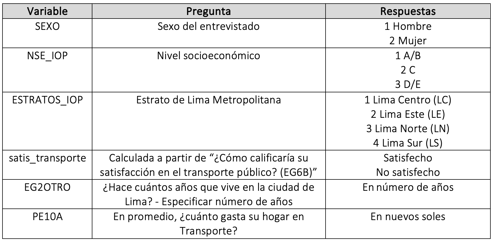
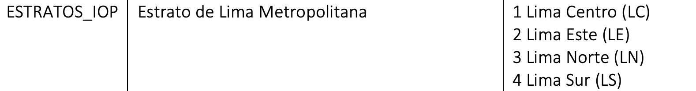

```{r setup, include=FALSE}
knitr::opts_chunk$set(warning = FALSE, message = FALSE) 
```

<center></center>

```{r,echo=FALSE, out.width="30%"}
knitr::include_graphics("logoPUCP.png") 
```

**FACULTAD DE CIENCIAS SOCIALES - PUCP**<br>

## Curso: POL 278 - Estadística para el análisis político 1 \| Semestre 2024 - 1 <br>

# **1.Intervalos de confianza**

Con este tema, comenzaremos a enfocarnos en la estadística inferencial. El objetivo de esta es determinar una aproximación del parámetro poblacional a partir de la data de una muestra representativa.

Revisemos algunos conceptos:

-   **Estimador puntual:** un número que es nuestra predicción del parámetro

-   **Intervalo de confianza:** un intervalo de números basado en la distribución de la data observada de la muestra dentro de la cual se cree que estaría el parámetro poblacional.

    *IC = estimador puntual +-/margen de error*

-   **Nivel de confianza:** es la probabilidad de que el parámetro se encuentre en ese intervalo.

-   **Margen de error:** mide qué tan precisa es la estimación del parámetro.

-   **Error de muestreo:** diferencia entre el valor calculado de un estadístico y valor real de un parámetro de la población.

```{r,echo=FALSE, out.width="50%",fig.align="center"}
knitr::include_graphics("IC.png") 
```

### Conceptualización e Importancia

-   Los intervalos de confianza ofrecen una manera de estimar, con alta probabilidad, un rango de valores en el que se encuentra el valor poblacional (o parámetro) de una determinada variable.
-   El intervalo de confianza describe la variabilidad entre la medida obtenida en un estudio y la medida real de la población (el valor real).
-   Un intervalo de confianza de 90%/95%/99% nos indica que dentro del rango dado se encuentra el valor real de un parámetro con 90%/95%/99% de certeza.
-   Existe una relación inversa entre la amplitud del IC y el tamaño muestral: mientras más pequeño es el n, más amplio es el IC. A mayor n, el IC es más estrecho.
-   Gracias al IC podemos determinar si la estimación es representativa de la población.

### Sobre el nivel de confianza...

Si tenemos un nivel de confianza de 95%, quiere decir que si realizamos 100 veces el mismo procedimiento de muestreo y calculamos los estadísticos de interés, 95 veces obtendremos los resultados en el intervalo calculado. Los mismo ocurriría si realizamos el cálculo con un 99% de confianza. Al momento de decidir el nivel de confianza debemos tener presente una regla: a mayor nivel de confianza, menor será la precisión ya que el intervalo es más amplio.

**Aplicación**

Carguemos la data "Limacomovamos-pd4.xlsx"

Lima como vamos es una encuesta realizada a ciudadanos de Lima y Callao con la finalidad de conocer su percepción acerca de la movilidad, ambiente, seguridad ciudadana, espacios de recreación, cultura y satisfacción con la ciudad. Pueden encontrar más información acerca de esta base [aquí](https://www.limacomovamos.org/data/).

Para esta sesión se usará una versión subseteada de años anteriores que contiene a las variables:

```{r, echo=FALSE, out.width="50%",fig.align="center"}
 
```

```{r}
library(rio) #Convocamos el paquete   
data=import("Limacomovamos-pd4.xlsx") 
```

En esta sesión responderemos a la pregunta:

### ¿Cuál es el estado del transporte en Lima según sus residentes?

# **1.Intervalos de confianza para una proporción**

Tengamos en consideración que para poder hallar el intervalo de confianza para una proporción debemos determinar nuestro caso de éxito. Asimismo, para hallar el intervalo de confianza para una proporción nuestra variable debe ser categórica y debe representar una variable dicotómica; es decir, una variable con solo dos categorías posibles: votó/no votó; sí/no, etc.

Recordemos la fórmula para hallar el intervalo de confianza para una proporción

```{r,echo=FALSE, out.width="50%",fig.align="center"}
knitr::include_graphics("ICprop.png") 
```

*Hallemos el intervalo de confianza para la proporción de las personas que están satisfechas con el transporte público en Lima.*

Para ello trabajaremos con la variable satis_transporte, que tiene dos valores posibles: Satisfecho y no satisfecho.

Para poder encontrar el intervalo de confianza para la proporción de ciudadanos de Lima y Callao satisfechos con el sistema de transporte, necesitamos tener muy claro la frecuencia de nuestro caso de éxito y del total de casos.

```{r}
table(data$satis_transporte)#realizamos una tabla de frecuencias
```

```{r}
x = 194 #almacenamos en "x" la frecuencia de nuestro caso de éxito (satisfecho)
n = 194 + 3544 #almacenamos en "n" el total de casos
```

Hallamos el invervalo de confianza para una proporción con el comando **prop.test**

```{r, results='hide'}
ic_prop = prop.test(x,n)
ic_prop #llamamos a ic_prop para visualizar los resultados
```

```{r,echo=FALSE, out.width="50%",fig.align="center"}
knitr::include_graphics("pd4resultprop.png") 
```

Esto quiere decir que tenemos un 95% de certeza de que, en la población, el porcentaje de ciudadanos de Lima y Callao satisfechos con el sistema de transporte oscila entre el 4.5% y 5.9% .

# **2.Intervalos de confianza para una media**

Recordemos la fórmula para hallar el intervalo de confianza para una media es


```{r,echo=FALSE, out.width="50%",fig.align="center"}
knitr::include_graphics("ICmedia.png") 
```

### ¿Cuánto gastan los residentes de Lima en transporte?

*Hallemos el intervalo de confianza para la media de la variable "PE10A".*

El enunciado de la pregunta es indicar "En promedio, ¿cuánto gasta su hogar en Transporte?".

```{r}
class(data$PE10A) #Revisemos que nuestra variable esté bien clasificada
```

**ciMean**, del paquete **lsr**, es la función que calcula el intervalo de confianza de una media.

```{r}
library(lsr)
ic_media = ciMean(data$PE10A, na.rm = TRUE) #con el último argumento indicamos no tomar en consideracion los valores perdidos (NA)

ic_media
```

# **3.Intervalo de confianza de una media según grupo**

### ¿De qué manera la zona de Lima en la que vive la persona se relaciona con su gasto en transporte?

Hallemos el intervalo de confianza para el gasto en trasporte en promedio (PE10A) según estrato de lima (ESTRATOS_IOP).

Agreguemos etiquetas a la categórica

```{r,echo=FALSE, out.width="50%",fig.align="center"}
 
```

```{r}
library(dplyr)
data = data %>% 
  mutate(ESTRATOS_IOP=factor(ESTRATOS_IOP, levels = (1:4), labels = c("Lima Centro","Lima Este","Lima Norte", "Lima Sur")))
```

1\. Crearemos una tabla con la media, máximo y mínimo de la variable PE10A, en base al grupo de ESTRATOS_IOP.

```{r}
ic_grupo = data %>% 
  dplyr::group_by(ESTRATOS_IOP) %>% 
  dplyr::summarise(Media = mean(PE10A, na.rm=T),
            min = ciMean(PE10A, na.rm=T)[1],
            max = ciMean(PE10A, na.rm=T)[2])
ic_grupo
```

Según nuestra tabla, podemos afirmar que hay un 95% de probabilidad de que a nivel poblacional la media del grupo que los residentes de Lima Centro y Lima Norte gastan más en transporte que los de Lima Este.

Grafiquemos nuestros resultados.

```{r}
library(ggplot2)
ggplot(ic_grupo, aes(x= ESTRATOS_IOP, y =Media)) +
  geom_errorbar(aes(ymin=min, ymax=max), width = 0.2)+
   geom_text(aes(label=paste(round(Media, 2))), size=4)+
  xlab("Zona de Lima") + ylab("Promedio del gasto en transporte")+
  ylim(30, 140) #indicamos los límites del eje y
```

Con lo que muestra el gráfico, ¿cómo podemos complementar nuestra interpretación anterior?

# **Ejercicio**

1.  Calcular el intervalo de confianza de la media para los años que llevan viviendo en Lima/Callao los residentes de Lima/Callao (EG2OTRO). Interprete
2.  Muestra un gráfico que los intervalos de confianza para la media de EG2OTRO según nivel socio económico (NSE_IOP). Interprete
3.  A partir de la variable EG2OTRO, se creó "Añoslima". Que tiene dos grupos "Más de 50 años" o "De 50 años a menos". Calcula el intervalo de confianza para la proporción de la variable "Añoslima" e interpreta.
