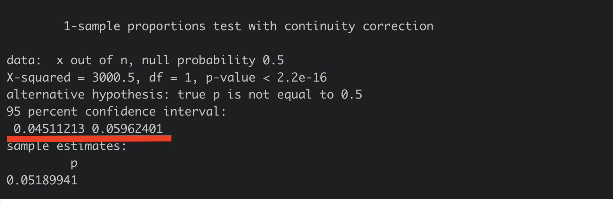

```{r setup, include=FALSE}
knitr::opts_chunk$set(warning = FALSE, message = FALSE) 
```

<center></center>

```{r,echo=FALSE, out.width="30%"}
knitr::include_graphics("logoPUCP.png") 
```

**FACULTAD DE CIENCIAS SOCIALES - PUCP**<br>

## Curso: POL 278 - Estadística para el análisis político 1 \| Semestre 2024 - 2 <br>

# **Intervalos de confianza**

Con este tema, nos adentraremos en el estudio de la estadística inferencial, cuyo objetivo es estimar y aproximar los parámetros poblacionales basados en los datos obtenidos de una muestra representativa. A través de este enfoque, podemos hacer generalizaciones válidas sobre una población completa a partir de un subconjunto de datos, permitiendo tomar decisiones y formular conclusiones fundamentadas.

Revisemos algunos conceptos:

-   **Estimador puntual:** un número que es nuestra predicción del parámetro

-   **Intervalo de confianza (IC):** un intervalo de números basado en la distribución de la data observada de la muestra dentro de la cual se cree que estaría el parámetro poblacional.

$$IC = \text{estimador puntual} \pm \text{margen de error}$$

-   **Nivel de confianza:** es la probabilidad de que el parámetro se encuentre en ese intervalo.

-   **Margen de error:** mide qué tan precisa es la estimación del parámetro.

-   **Error de muestreo:** diferencia entre el valor calculado de un estadístico y valor real de un parámetro de la población.

```{r,echo=FALSE, out.width="50%",fig.align="center"}
knitr::include_graphics("IC.png") 
```

### Conceptualización e Importancia

-   Los intervalos de confianza ofrecen una manera de estimar, con alta probabilidad, un rango de valores en el que se encuentra el valor poblacional (o parámetro) de una determinada variable.
-   El intervalo de confianza describe la variabilidad entre la medida obtenida en un estudio y la medida real de la población (el valor real).
-   Un intervalo de confianza de 90%/95%/99% nos indica que dentro del rango dado se encuentra el valor real de un parámetro con 90%/95%/99% de certeza.
-   Existe una relación inversa entre la amplitud del IC y el tamaño muestral: mientras más pequeño es el n, más amplio es el IC. A mayor n, el IC es más estrecho.
-   Gracias al IC podemos determinar si la estimación es representativa de la población.

### Sobre el nivel de confianza

Si tenemos un nivel de confianza de 95%, quiere decir que si realizamos 100 veces el mismo procedimiento de muestreo y calculamos los estadísticos de interés, 95 veces obtendremos los resultados en el intervalo calculado. Los mismo ocurriría si realizamos el cálculo con un 99% de confianza. Al momento de decidir el nivel de confianza debemos tener presente una regla: a mayor nivel de confianza, menor será la precisión ya que el intervalo es más amplio.

### **1.Intervalos de confianza para una proporción**

Tengamos en consideración que para poder hallar el intervalo de confianza para una proporción debemos determinar nuestro caso de éxito. Asimismo, para hallar el intervalo de confianza para una proporción nuestra variable debe ser categórica y debe representar una variable dicotómica; es decir, una variable con solo dos categorías posibles: votó/no votó; sí/no, etc.

Recordemos la fórmula para hallar el intervalo de confianza para una proporción

```{r,echo=FALSE, out.width="70%",fig.align="center"}
knitr::include_graphics("ICprop.png") 
```
**Ejemplo práctico:**

```{r,echo=FALSE, out.width="50%",fig.align="center"}
 
```

Una empresa muy conocida de comida para gatos llamada _Furbys_ desea realizar un relanzamiento de marca. Para ello crean el eslogan "8 de cada 10 gatos prefieren Furbys". Sin embargo, debido a un reclamo de los alumnos del curso de Estadística, esta vez la empresa decide realizar el sustento de su eslogan.


```{r}
library(rio)
cats=import("cats.xlsx")
str(cats)
```
```{r}
table(cats$Furbys)
```

Formateo la variable _Furbys_ 
```{r}
library(dplyr)
cats = cats %>%
  mutate(Furbys = factor(Furbys, levels = c("sí", "no")))
str(cats) #corroboro que ya cuento con mi categórica
```
```{r}
tablaCats = cats %>%
  filter(Furbys =="sí" | Furbys == "no") %>%
  count(Éxito = Furbys, name="N") %>%
  mutate(total = sum(N), 
         Porcentaje = N / total * 100)
tablaCats
```
```{r}
prop.test(248,400) #caso de éxito y total
```
Con base en los resultados del test de proporciones para una muestra de 400 gatos, se estima que la proporción de gatos que prefieren la marca de comida _Furbys_ está entre el 57.02% y el 66.74%, con un intervalo de confianza del 95%. Esto significa que, si se tomaran múltiples muestras aleatorias de la misma población, en aproximadamente el 95% de las ocasiones la proporción verdadera de gatos que prefieren _Furbys_ caería dentro de este rango.

La proporción observada en la muestra es del 62%, lo que sugiere que 6 de cada 10 gatos prefieren _Furbys_. En consecuencia, se puede afirmar con evidencia estadística que una mayoría de gatos prefiere esta marca.

Si se deseara utilizar este resultado como base para una campaña publicitaria, una frase como "6 de cada 10 gatos prefieren Furbys" sería un eslogan adecuado, sustentado en los datos obtenidos.


### **2.Intervalos de confianza para una media**

Recordemos la fórmula para hallar el intervalo de confianza para una media es:

```{r,echo=FALSE, out.width="70%",fig.align="center"}
knitr::include_graphics("ICmedia.png") 
```
-   **Puntuación Z:** Se ha considerado 1.96 dado que es lo que corresponde al considerar el nivel de confianza de 95% en una distribución normal.

$$IC = \bar{X} \pm 1.96 \times \frac{s}{\sqrt{n}}$$


### **3.Intervalo de confianza de una media según grupo**

El análisis de medias por grupos mediante intervalos de confianza (IC) es una herramienta fundamental en la inferencia estadística, ya que permite estimar el rango en el que es probable que se encuentre la media poblacional de cada grupo, con un determinado nivel de confianza, como el 95%. Este enfoque es útil cuando se quiere comparar subgrupos dentro de una población, ya sea por género, nivel socioeconómico, ubicación geográfica, entre otros.

Un aspecto clave del análisis con intervalos de confianza es observar si los intervalos de los grupos se solapan o no:

-  Si los intervalos no se cruzan, se puede inferir que existe una diferencia significativa entre las medias de los grupos.

- Si los intervalos se solapan, no podemos afirmar con certeza que las medias sean significativamente diferentes, lo que sugiere que las diferencias observadas podrían deberse al azar.


# **Prueba T**

Generalmente, cuando queremos comparar dos grupos centramos nuestra atención en el promedio de cada uno. Sin embargo, el hecho de que los promedios sean distintos no supone, necesariamente, que existe una diferencia **estadísticamente significativa**.

Para saber si la diferencia observada entre las medias de dos grupos es o no significativa se emplean métodos paramétricos como el de Z-scores o la distribución T-student. Estas técnicas calculan los intervalos de confianza de cada grupo y concluyen si existe una diferencia _real_ entre las medias.

La prueba T compara la media de una variable numérica para dos grupos o categorías de una variable nominal u ordinal. Los grupos que forman la variable nominal/ordinal tienen que ser independientes. Es decir, cada observación debe pertenecer a un grupo o al otro, pero **no** a ambos.

**Ejemplo práctico:**


# **🚙 Dinámicas del uso de los medios de transporte en Lima** 

El crecimiento acelerado de Lima ha generado una creciente preocupación sobre la calidad y eficiencia de los medios de transporte en la ciudad. La congestión vehicular, la falta de infraestructura adecuada y los largos tiempos de viaje afectan diariamente a millones de limeños. En este contexto, el análisis de datos cuantitativos se vuelve indispensable para entender el comportamiento de los usuarios, identificar áreas críticas y diseñar soluciones efectivas. En ese sentido en esta sesión responderemos a la siguiente pregunta:

<style>
.custom-text {
  color: #00688B;
  font-family: Helvetica, sans-serif;
  text-align: center;
  font-weight: bold;
  font-size: 22px;
}
</style>

::: custom-text
쮺uál es el estado del transporte en Lima según sus residentes? 游뱂
:::

Para acercarnos a responder la pregunta antes planteada se buscó información relacionada al uso del transporte público en Lima. Por lo tanto se eligió la encuesta de Lima Como Vamos, la cual es realizada a ciudadanos de Lima y Callao con la finalidad de conocer su percepción acerca de la movilidad, ambiente, seguridad ciudadana, espacios de recreación, cultura y satisfacción con la ciudad. Pueden encontrar más información acerca de esta base [aquí](https://www.limacomovamos.org/data/).

Para esta sesión se usará una versión *subseteada* de años anteriores que contiene las siguientes variables:

```{r, echo=FALSE, out.width="70%",fig.align="center"}
knitr::include_graphics("pd4-diccionario.png") 
```

```{r}
data=import("Limacomovamos-pd4.xlsx") 
```

<hr> 
<hr> 

<h4 style="color: #00688B; text-align: center;"><b>쮺uál es el intervalo de confianza para la proporción de las personas que están satisfechas con el transporte público en Lima?</b></h4>


Para ello trabajaremos con la variable satis_transporte, que tiene dos valores posibles: Satisfecho y no satisfecho.

Para poder encontrar el intervalo de confianza para la proporción de ciudadanos de Lima y Callao satisfechos con el sistema de transporte, necesitamos tener muy claro la frecuencia de nuestro caso de éxito y del total de casos.

```{r}
tablaSatis = data %>%
  filter(satis_transporte =="No satisfecho" | satis_transporte == "Satisfecho") %>%
  count(Éxito = satis_transporte, name="N") %>%
  mutate(total = sum(N), 
         Porcentaje = N / total * 100)
tablaSatis
```

Hallamos el invervalo de confianza para una proporción con el comando **prop.test**

```{r, results='hide'}
prop.test(194,3738) #casos de éxito y el total de casos.
```

```{r,echo=FALSE, out.width="70%",fig.align="center"}
 
```
Esto quiere decir que tenemos un 95% de certeza de que, en la población, el porcentaje de ciudadanos de Lima y Callao satisfechos con el sistema de transporte oscila entre el 4.5% y 5.9% .
<hr> 
<hr> 

<h4 style="color: #00688B; text-align: center;"><b>쮺uánto gastan los residentes de Lima en transporte?</b></h4>


*Hallemos el intervalo de confianza para la media de la variable "PE10A".*

El enunciado de la pregunta es indicar "En promedio, 쯖uánto gasta su hogar en Transporte?".

```{r}
class(data$PE10A) #Revisemos que nuestra variable esté bien clasificada
```

**ciMean**, del paquete **lsr**, es la función que calcula el intervalo de confianza de una media.

```{r}
library(lsr)
ic_media = ciMean(data$PE10A, na.rm = TRUE) #con el último argumento indicamos no tomar en consideracion los valores perdidos (NA)

ic_media
```
<hr> 
<hr> 

<h4 style="color: #00688B; text-align: center;"><b>쮻e qué manera la zona de Lima en la que vive la persona se relaciona con su gasto en transporte?</b></h4>


Hallemos el intervalo de confianza para el gasto en trasporte en promedio (PE10A) según estrato de lima (ESTRATOS_IOP).

Agreguemos etiquetas a la categórica

```{r,echo=FALSE, out.width="70%",fig.align="center"}
knitr::include_graphics("pd4-estratos.png") 
```

```{r}
data = data %>% 
  mutate(ESTRATOS_IOP=factor(ESTRATOS_IOP, levels = (1:4), labels = c("Lima Centro","Lima Este","Lima Norte", "Lima Sur")))
```

Crearemos una tabla con la media, máximo y mínimo de la variable PE10A, en base al grupo de ESTRATOS_IOP.

```{r}
ic_grupo = data %>% 
  dplyr::group_by(ESTRATOS_IOP) %>% 
  dplyr::summarise(Media = mean(PE10A, na.rm=T),
            min = ciMean(PE10A, na.rm=T)[1],
            max = ciMean(PE10A, na.rm=T)[2])
ic_grupo
```

Según nuestra tabla, podemos afirmar que hay un 95% de probabilidad de que a nivel poblacional la media del grupo que los residentes de Lima Centro y Lima Norte gastan más en transporte que los de Lima Este.

Grafiquemos nuestros resultados.

```{r}
library(ggplot2)

ggplot(ic_grupo, aes(x = ESTRATOS_IOP, y = Media)) +
  geom_bar(stat = "identity", fill = "#00688B", color = "black") +
  geom_errorbar(aes(ymin = min, ymax = max), width = 0.2) +
  
  # Etiquetas de la media
  geom_text(aes(label = paste(round(Media, 2))), vjust = -1, size = 4) +
  
  # Etiquetas de los valores mínimos
  geom_text(aes(y = min, label = paste("min:", round(min, 2))), 
            vjust = 1.5, hjust = -0.2, size = 3, color = "white") +
  
  # Etiquetas de los valores máximos
  geom_text(aes(y = max, label = paste("max:", round(max, 2))), 
            vjust = -0.5, hjust = -0.2, size = 3, color = "#00688B") +
  
  xlab("Zona de Lima") + 
  ylab("Promedio del gasto en transporte") +
  ylim(0, 140) +
  theme_minimal()

```

Con lo que muestra el gráfico, 쯖칩mo podemos complementar nuestra interpretación anterior?

- Lima Centro gasta significativamente más que Lima Este y Lima Sur, como lo indican los promedios y la falta de superposición considerable entre los IC.
- Lima Norte presenta un rango de gasto más amplio, lo que sugiere una variabilidad mayor en el gasto de transporte dentro de esa zona.
- Lima Este tiene un gasto más bajo y su intervalo de confianza no se superpone con el de Lima Centro, lo que podría indicar diferencias estadísticamente significativas entre estas dos zonas.

<h4 style="color: #00688B; text-align: center;"><b>쮼xiste una diferencia estadísticamente significativa entre el gasto en transporte entre hombres y mujeres?</b></h4>

Reviso mi df
```{r}
str(data)
```
```{r}
GSexo = data |> 
  group_by(SEXO) |>
  summarize(Media = mean(PE10A, na.rm = T))
GSexo
```
```{r}
GSexo[1,2] - GSexo[2,2]
```
La diferencia es de aprox 11 soles. 쯇uedo afirmar que existe esta diferencia en la población?

Para poder evaluar si existen o no diferencias poblacionales usaremos t.test

```{r}
t.test(PE10A ~ SEXO, data = data)
```
El valor p- value es 0.2642, que es mayor que el nivel típico de significancia (generalmente α = 0.05). Un valor p alto sugiere que *no* hay suficiente evidencia para rechazar la hipótesis nula. En otras palabras, no podemos concluir que existe una diferencia significativa entre las medias de los dos grupos (hombres y mujeres) con respecto a la variable PE10A.

# **Ejercicios para casa**

1.  Calcular el intervalo de confianza de la media para los años que llevan viviendo en Lima/Callao los residentes de Lima/Callao (EG2OTRO). Interprete
2.  Muestra un gráfico que los intervalos de confianza para la media de EG2OTRO según nivel socio económico (NSE_IOP). Interprete
3.  A partir de la variable EG2OTRO, se creó "Añoslima". Que tiene dos grupos "Más de 50 años" o "De 50 años a menos". Calcula el intervalo de confianza para la proporción de la variable "Añoslima" e interpreta.
