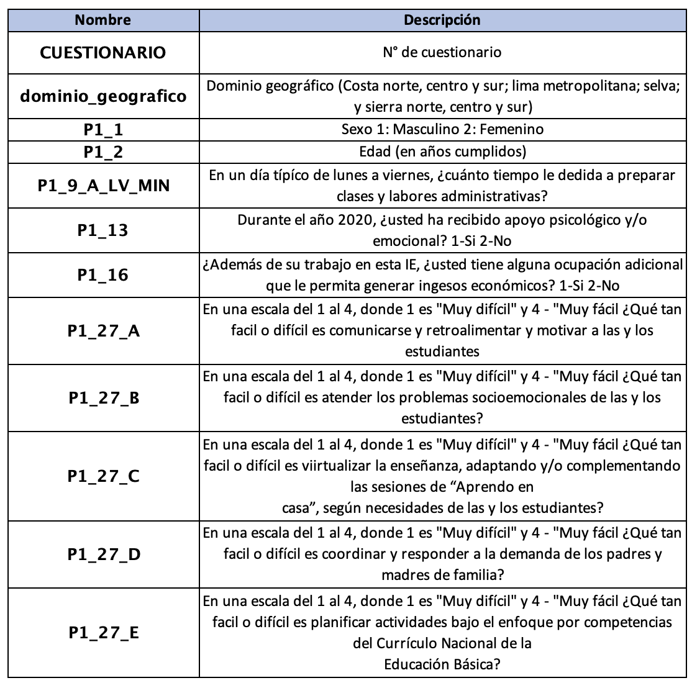

```{r setup, include=FALSE}
knitr::opts_chunk$set(warning = FALSE, message = FALSE) 
```

<center></center>

```{r,echo=FALSE, out.width="30%"}
knitr::include_graphics("logoPUCP.png") 
```

# **Revisemos lo avanzado sobre estadística inferencial**

En esta sesión repasaremos lo revisado hasta el momento sobre intervalos de confianza; así como también, recordaremos cómo crear un indicador.

Hoy emplearemos algunas variables de la Encuesta Nacional de Docentes ENDO 2020, realizada por el Ministerio de Educación. Esta encuesta pretende recoger información acerca de los docentes y sus característica sociodemográficas, económicas, sus percepciones, condiciones de trabajo, y más. Si quieres conocer más acerca de esta encuesta ingresa al siguiente [link](#0).

Llamemos a los paquetes que usaremos

```{r}
library(rio)
library(lsr)
library(dplyr)
library(ggplot2)
```

Importemos la base de datos

```{r}
data=import("Endo-2021-sub.sav")
```

```{r,echo=FALSE, out.width="80%"}
 
```

Revisemos nuestra base

```{r, include=TRUE, eval=FALSE}
str(data)
names(data)
```

# **1. Intervalo de confianza para la media:**

Para el intervalo de confianza para la media crearemos el indicador: **percepción de facilidad de labor docente, este indicador debe ir del 0 al 10**. Para ello nos basaremos en cinco variables que responden a "En una escala del 1 al 4, donde 1 es"Muy difícil" y 4 - "Muy fácil ¿Qué tan facil o difícil es realizar las siguientes actividades vinculadas al quehacer docente?"

| Nombre de variable |                                                                Etiqueta                                                                |
|:-------------:|:-------------------------------------------------------:|
|      P1_27_A       |                       ¿Qué tan fácil o difícil es comunicarse y retroalimentar y motivar a las y los estudiante                        |
|      P1_27_B       |                                   ¿Atender los problemas socioemocionales de las y los estudiantes?                                    |
|      P1_27_C       | ¿Virtualizar la enseñanza, adaptando y/o complementando las sesiones de "Aprendo en casa", según necesidades de las y los estudiantes? |
|      P1_27_D       |                                 ¿Coordinar y responder a la demanda de los padres y madres de familia?                                 |
|      P1_27_E       |                ¿Planificar actividades bajo el enfoque por competencias del Currículo Nacional de la Educación Básica?                 |

### Recordemos los pasos para construir un indicador:

1.  Verificar que las variables correspondan al concepto.
2.  Revisar el sentido de las categorías en el cuestionario/diccionario
3.  Si las categorías están en el correcto sentido, proceder a sumarlas; si no lo están, proceder a recodificarlas para luego sumar. **Recuerda que para sumarlas deben ser variables tipo numéricas.**
4.  Una vez realizada la suma, identificar el mínimo y el máximo.
5.  Restar a todos los valores el mínimo.
6.  Al resultado, dividir por el máximo menos el mínimo (según lo identificado anteriormente) para obtener valores entre 0 y 1.
7.  Multiplicar por el número que será el nuevo máximo. Ej: si queremos que el indice vaya de 0 a 100, multiplicar por 100, etc.

Ya habíamos revisado previamente que las variables si están como numéricas.

```{r}
data = data %>%
  mutate(suma=P1_27_A+P1_27_B+P1_27_C+P1_27_D+P1_27_E) #creamos la suma 
summary(data$suma) #identifico mínimo y máximo

```

Procedo a crear el indicador

```{r}
data = data %>%
  mutate(indicador = ((suma-5)/15)*10) #le restamos el mínimo y dividimos entre 20-5
<<<<<<< HEAD
#Lo multiplicamos por 10 porque queremos que vaya hasta 0 al 10
=======
#Lo multiplicamos por 10 porque queremos que vaya hasta 10
>>>>>>> ee5e6a199300472be30e2caf43bce0d11f5b4665
  summary(data$indicador)#revisamos que se haya creado bien el indicador

```

#### *Dato adicional:*

Si queremos cambiar la escala de nuestro indicador podemos usar la función rescale, como primer argumento indicamos la variable (indicador) a reescalar y como segundo argumento los límites de la nueva escala: de 0 a 50, de 0 a 100, etc.

```{r, include = T, eval = F}
library(scales)
data$ind_reescalado = rescale(data$indicador, to = c(0,10))
```

Ahora que hemos creado nuestro indicador, procedemos a calcular el intervalo de confianza para su media.

```{r}
ic_media = ciMean(data$indicador)
ic_media
```

Nuestra media poblacional se encuentra entre 4.9 y 5. Esto quiere decir que tenemos una certeza del 95% de que el valor poblacional de la **percepción de facilidad de labor docente** se encuentra entre 4.9 y 5. Lo que se encuentra muy cercano al punto medio del indicador (5).

# **2.Intervalos de confianza para una proporción**

Tengamos en consideración que para poder hallar el intervalo de confianza para una proporción debemos determinar nuestro caso de éxito. Asimismo, para hallar el intervalo de confianza para una proporción nuestra variable debe ser categórica y debe representar una variable dicotómica; es decir, una variable con solo dos categorías posibles.

*Hallemos el intervalo de confianza para la proporción de los docentes que tienen una ocupación adicional que genere ingresos (P1_16 1-Si, 2-No).*

Necesitamos tener muy claro la frecuencia de nuestro caso de éxito (1) y del total de casos.

```{r}
table(data$P1_16)
```

*Nuestro caso de éxito es haber recibido este tipo de apoyo, por lo tanto el primer argumento que ingresaremos en el prop.test es 2471. Por otro lado, el total de casos es 2471 + 16436. Con eso claro, procedamos a calcular el intervalo de confianza.*

```{r}
x = 2471 #almacenamos en "x" la frecuencia de nuestro caso de éxito
n = 2471 + 16436 #almacenamos en "n" el total de casos
```

Hallamos el invervalo de confianza para una proporción con el comando **prop.test**

```{r}
ic_prop = prop.test(x,n)
ic_prop #llamamos a ic_prop para visualizar los resultados
```

Lo que hallamos nos permite afirmar con un 95% de confianza que, a nivel poblacional, el porcentaje de docentes que cuentan con una ocupación adicional que genera ingresos se encuentra entre 12.6% y 13.6%.

# **3.Intervalo de confianza de una media según grupo**

Hallemos el intervalo de confianza para el indicador de percepción de facilidad de labor docente, según el dominio geográfico. En este caso, queremos comparar según si son de la costa, sierra o selva. Para ello debemos dejar fuera a los casos de Lima Metropolitana y crear una nueva variable (region) que se base en dominio geográfico y realizar los siguientes cambios si es costa norte, coste centro o costa sur que se convierta en costa, si es selva que siga siendo selva y si es sierra norte, sierra centro o sierra sur que se convierta en sierra.

```{r}
data = data %>%
  filter(!(dominio_geografico == "LIMA METROPOLITANA"))%>%
  mutate(region = case_when(dominio_geografico == "COSTA NORTE"|dominio_geografico == "COSTA CENTRO"| dominio_geografico == "COSTA SUR" ~ "COSTA",
                            dominio_geografico == "SELVA" ~ "SELVA",
                            dominio_geografico == "SIERRA NORTE"|dominio_geografico == "SIERRA CENTRO"| dominio_geografico == "SIERRA SUR" ~ "SIERRA"))

```

```{r}
#VERSIÓN CORTA
#data = data %>%
#  filter(!(dominio_geografico == "LIMA METROPOLITANA"))%>%
#  mutate(region = case_when(dominio_geografico %in% c("COSTA NORTE","COSTA CENTRO","COSTA SUR") ~ "COSTA",
#                            dominio_geografico == "SELVA" ~ "SELVA",
#                            T ~ "SIERRA"))
```

Revisemos que nuestros datos se hayan asignado bien

```{r}
table(data$dominio_geografico)
table(data$region)
```

Ahora si procedemos a calcular el intervalo de confianza para la media del indicador de percepción de facilidad de labor docente según region.

```{r}
ic_grupo = data %>%
  group_by(region) %>%
  summarise(Media = mean(indicador, na.rm=T),
            min = ciMean(indicador, na.rm=T)[1],
            max = ciMean(indicador, na.rm=T)[2]
            )
ic_grupo
```

Según nuestra tabla, podemos afirmar que hay un 95% de probabilidad de que a nivel poblacional la media de los docentes de la sierra perciben una menor facilidad en sus labores. Mientras que los de la costa perciben sus labores como más sencillas. Veamos el gráfico para complementar esta afirmación.

```{r}
ggplot(ic_grupo, aes(x= region, y =Media)) +
  geom_errorbar(aes(ymin=min, ymax=max), width = 0.2)+
   geom_text(aes(label=paste(round(Media, 2))), size=4)+
  xlab("Región") + ylab("Indicador de percepción de facilidad de labor docente")+
  theme_bw()
```

Debemos que buscar traslape entre las barras, en este caso podemos reafirmar que los docentes de la sierra perciben una menor facilidad en sus labores a comparación de los de la selva o costa. Por otro lado, los docentes de la selva, perciben mayor facilidad que los de la sierra, pero menor que los de la costa. A pesar de estar muy cercanas sus barras, sabemos que no hay traslape por la anterior tabla. Esta nos indicaba que el límite superior de selva es de 5.11; mientras que el límite inferior de costa es de 5.12.

## Ejercicio

1.  Calcular el intervalo de confianza para la media de la variable que mide el tiempo invertido en preparar las clase y labores administrativas de lunes a viernes (P1_9_A_LV_MIN)

```{r}
str(data$P1_9_A_LV_MIN)
```

2.  Calcular el intervalo de confianza para la proporción de personas que recibieron apoyo psicológico y/o emocional (P1_13)

3.  Calcula el intervalo de confianza para la media de la variable P1_9_A_LV_MIN según sexo (P1_1)
