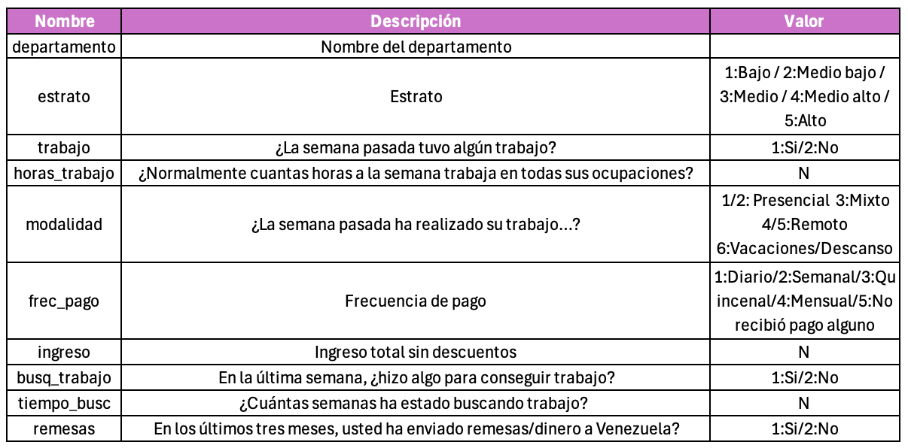

```{r,echo=FALSE, out.width="30%"}
knitr::include_graphics("logoPUCP.png") 
```

**FACULTAD DE CIENCIAS SOCIALES - PUCP**<br>

## Curso: POL 278 - Estadística para el análisis político 1 \| Semestre 2024 - 2 <br>

------------------------------------------------------------------------

```{r warning=FALSE,message=FALSE}
library(rio)
library(dplyr)
library(lsr)
library(ggplot2)
```

Usaremos la Encuesta Nacional de Población Venezolana (ENPOVE) - 2022.

# **¿Cuál es la situación del empelo de la población venezolana en el Perú?**

```{r}
data = import("Repaso.sav")
names(data)
```

Diccionario de datos



## **1. Análisis descriptivo**

### ¿Cuál es la proporción de venezolanos con empleo? (trabajo)

```{r}
data = data %>% 
  mutate(trabajo =factor(trabajo,labels=c("Si","No")))
```

```{r}
tabla1 = data %>% 
  filter(!is.na(trabajo)) %>% 
  group_by(trabajo) %>% 
  summarise(Freq=n()) %>% 
  mutate(Porcentaje = (Freq/sum(Freq))*100)
tabla1
```

En la muestra, un 59% de venezolanos que residen en Perú, contaba con empleo.

```{r}
ggplot(tabla1, aes(x=trabajo,y=Porcentaje,fill=trabajo))+
  geom_bar(stat="identity")+
  geom_text(aes(label=paste(round(Porcentaje,1),"%")),vjust=1.30, color="black", size=3)+
  ggtitle("Venezolanos en Perú con empleo (%)")+xlab("¿La semana pasada tuvo algún trabajo?")+theme_classic()

```

### ¿Cuánto ganan los venezolanos con empleo en el Perú?

```{r}
data %>% 
  summarise(minimo=min(ingreso,na.rm = T),
            maximo=max(ingreso,na.rm = T),
            media=mean(ingreso,na.rm = T),
            mediana=median(ingreso,na.rm = T),
            sd=sd(ingreso,na.rm = T),
            Q1=quantile(ingreso,na.rm = T,0.25),
            Q3=quantile(ingreso,na.rm = T,0.75))
```

```{r,warning=FALSE,message=FALSE}
data %>%
  ggplot(aes(x = ingreso)) + 
  geom_histogram(color = "black", fill = "hotpink1", bins = 40) +
  ggtitle("Salario de la población venezolana en Perú ") +
  ylab("Frecuencia")+xlab("Salario")+
  geom_vline(xintercept =  mean(data$ingreso, na.rm = TRUE), color = "red", linetype = "dashed", size = 1) + # Línea de la media
  geom_vline(xintercept = median(data$ingreso, na.rm = TRUE), color = "grey", linetype = "dashed", size = 1) + # Línea de la mediana
  theme_minimal()

```

## **2. Intervalo de confianza para proporción**

Encontramos que la proporción de venezolan\@s con empleo en el Perú es de 59%, calculemos cuanto será este valor en la población.

Previamente ya habíamos calculado la frecuencia de los que contaban con empleo y los que no, ingresemos esos datos en el prop.test

```{r}
tabla1
```

```{r}
prop.test(5987,5987+4240)
```

La proporción de venezolanos/as con empleo en Perú se encuentra entre 57.5% y 59.4%, a un 95% de confianza.

## **3. Intervalo de confianza para media**

Anteriormente, encontramos que los venezolanos en Perú ganan en promedio 511 soles.
Calculemos cuanto es este valor en la población.

```{r}
data %>% 
  summarise(media = mean(ingreso,na.rm=T),
            Superior = ciMean(ingreso,na.rm=T),
            Inferior = ciMean(ingreso,na.rm=T))
```

A un 95% de confianza podemos concluir que, en promedio, un/a venezolan\@ que trabaja en Perú gana aproximadamente entre 492.2 y 529.7 soles.
Hay que tener en consideración que este monto es en cada pago, que puede ser quincenal, mensual, etc.

## **4. Prueba T**

### ¿Existe diferencia entre el monto percibido (ingreso) entre los venezolanos que envían remesas (remesas) y los que no?

```{r}
data = data %>% mutate(remesas = factor(remesas, labels = c("Si","No")))
```

```{r}
grafico = data %>% 
  filter(!is.na(remesas)) %>% 
  group_by(remesas) %>% 
  summarise(media = mean(ingreso,na.rm=T),
            Superior = ciMean(ingreso,na.rm=T)[1],
            Inferior = ciMean(ingreso,na.rm=T)[2])
grafico
```

En la muestra si existe una diferencia entre los ingresos de los que envían remesas y los que no.
Siendo el ingreso más alto el de los que sí envían.
Analicemos si esto se cumple en la población de venezolanos en Perú.

```{r}
t.test(ingreso~remesas,data)
```

H0: No existe diferencia entre los promedios de ingreso de los que envían remesas y los que no. /H1: Existe diferencia entre los promedios de ingreso de los que envían remesas y los que no.

Analizando el pvalor, podemos rechazar la hipótesis nula y así afirmar que las medias de ingreso de los que envían remesas y los que no, no son iguales.

Constatemos cual es la media más alta con un gráfico:

```{r}
ggplot(grafico,aes(x=remesas,y=media))+
  geom_errorbar(aes(ymin=Inferior,ymax=Superior),width=0.4)+
  xlab("Ingreso")+
  ylab("¿Envía remesa?")+theme_classic()
```

## **5. Prueba Chi Cuadrado**

¿De qué manera se relaciona el estrato con el envío de remesas?

```{r}
data = data %>% 
  mutate(estrato = factor(estrato,labels=c("Bajo","Medio bajo","Medio","Medio alto","Alto")))
```

```{r}
table(data$remesas)
```

```{r}
tabla1=table(data$estrato,data$remesas)
tabla1
```

Revisemos el supuesto

```{r}
chisq.test(tabla1)$expected
```

Si cumple con el mínimo por celda.

```{r}
tablapor1 = tabla1 %>%
           prop.table(1) %>%  
           round(2) #redondear el resultado a 2 decimales
tablapor1
```

```{r}
toPlot1 = as.data.frame(tablapor1) 
names(toPlot1) = c("Estrato", "Remesa", "Porcentaje")
```

```{r}
  ggplot(toPlot1, aes(x=Estrato, y=Porcentaje*100, fill=Remesa)) +
  geom_bar(position="stack", stat="identity")+ #Stack indica que son barras apiladas
  geom_text(aes(label=paste0(Porcentaje*100,"%")), 
            position = position_stack(vjust = 0.5), 
             size = 4,
             fontface="bold")+
  labs(x="Estrato", y="Porcentaje", fill="¿Envía remesa?")+
  theme_minimal()
```

```{r}
chisq.test(tabla1)
```
