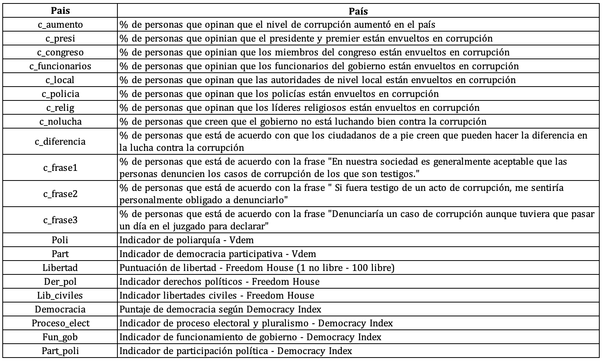

<center></center>

```{r,echo=FALSE, out.width="30%"}
knitr::include_graphics("logoPUCP.png") 
```

**FACULTAD DE CIENCIAS SOCIALES - PUCP**<br>

## Curso: POL 278 - Estadística para el análisis político 1 \| Semestre 2024 - 1 <br>

------------------------------------------------------------------------

## **Diagramas de dispersión y correlación**

### Ideas clave

La correlación es en esencia una medida normalizada de asociación o covariación lineal entre dos variables.

-   La **correlación** es una medida de la relación (covariación) entre **dos variables cuantitativas.**

-   La manera más sencilla de saber si dos variables están correlacionadas es determinar si co-varían (varían conjuntamente).

-   Es importante hacer notar que **esta covariación o relación no implica necesariamente causalidad**: La correlación puede ser fortuita, como en el caso clásico de la correlación entre el número de venta de helados e incendios, debido al efecto de una tercera variable, la temperatura ambiental.
    A este tipo de relación se le llama "espuria".

### Hipótesis de la prueba de correlación

-   H0 : No existe correlación entre las variables
-   H1 : Existe correlación entre las variables

### Coeficiente de Correlación de Pearson

-   "El Coeficiente de Correlación de Pearson es un estadístico paramétrico, pues se asume que ambas variables tienen una distribución aproximadamente normal, o sea, distribución normal bivariante".

-   Es una medida que **puede variar entre -1 y +1**, ambos extremos indicando correlaciones perfectas, negativa y positiva respectivamente.

-   Un valor de r = 0 indica que no existe relación lineal entre las dos variables.


### Gráfico de dispersión


Otros ejemplos:


### Aplicación práctica

# Pregunta de investigación

```{=html}
<style>
.custom-text {
  color: #00688B;
  font-family: Helvetica, sans-serif;
  text-align: center;
  font-weight: bold;
  font-size: 22px;
}
</style>
```
::: custom-text
¿Cómo se relaciona la percepción de corrupción con los indicadores de democracia con los países?
🤔
:::

Para la sesión de hoy trabajaremos con una base de datos que contiene variables obtenidas de las siguientes bases: - Freedom in the World - V-Dem - Democracy Index - Global Corruption Barometer

Información sobre las bases: - Freedom in the World es elaborado por Freedom House y analiza los siguientes aspectos: el proceso electoral, las políticas pluriculturales y la participación, el funcionamiento del gobierno, la libertad de expresión y de creencia, los derechos de asociación y organización, el estado de derecho, la autonomía personal y los derechos individuales.

V-Dem es publicada por el V-Dem Institute.
En ella se describe la calidad de los gobiernos a partir de información de 542 indicadores.
La data describe todos los aspectos de un gobierno, brindándo énfasis en la calidad de la democracia, la inclusividad y otros indicadores económicos.

Democracy Index es elaborado por The Economist y utiliza 60 indicadores, agrupados en cinco categorías: proceso electoral y pluralismo, libertades civiles, funcionamiento del gobierno, participación política y política cultural.
A partir de estas categorías posiciona a los países en alguno de los cuatro tipos de régimen: Democracia plena, democracia imperfecta, régimen híbrido y régimen autoritario.

Global Corruption Barometer es publicado por Transparencia Internacional y contiene información proveniente de la opinión pública ciudadana



### Cargamos nuestra base de datos:

```{r message=FALSE,warning=FALSE}
library(rio)
library(dplyr)
library(ggplot2)

data=import("corrupcion-democracia-1.xlsx")
names(data)
```

### Ejercicio 1: ¿Existe relación entre el indicador de democracia y el porcentaje de personas que perciben que los funcionario son corruptos en el país?

**Paso 1: Exploramos variables de interés**

Primero analicemos la variable **c_funcionarios**:

```{r }
str(data$c_funcionarios)
```

Análisis descriptivo de la variable **c_funcionarios**:

```{r }
data %>%
 summarize(Min = min(c_funcionarios, na.rm = TRUE),
           Media = mean(c_funcionarios, na.rm = TRUE),
           Mediana = median(c_funcionarios, na.rm = TRUE),
           Max = max(c_funcionarios, na.rm = TRUE))
```

Ahora, analicemos nuestra segunda variable **Democracia**:

```{r }
str(data$Democracia)
```

Análisis descriptivo de la variable **Democracia**:

```{r }
data %>%
 summarize(Min = min(Democracia, na.rm = TRUE),
           Media = mean(Democracia, na.rm = TRUE),
           Mediana = median(Democracia, na.rm = TRUE),
           Max = max(Democracia, na.rm = TRUE))
```

**Paso 2: Gráfico de dispersión**

Visualizamos la relación entre dos variables cuantitativas.
Esta "nube" de puntos en el gráfico de dispersión nos da una idea visual (preliminar) de la probable relación entre las variables.

```{r warning=FALSE,message=FALSE}
ggplot(data, aes(x=c_funcionarios, y=Democracia)) +
  geom_point(colour="skyblue") +  xlab("% de personas que opinan que los funcionarios del \n gobierno están envueltos en corrupción") +  ylab("Puntaje de democracia") +
  ggtitle("Relación entre la percepción de corrupción \n de funcionarios del gobierno y la democracia") +
  theme_light()+ geom_smooth(method=lm,se=F)
```

¿Qué nos indica el gráfico?
¿Existirá correlación?
¿Con qué fuerza?
¿Qué sentido?

El gráfico nos indica una correlación negativa.
Adicionalmente, es posible asociar la distribución de los puntos con una correlación pequeña o mediana.
¿Cómo sabremos la fuerza de la correlación?
Con la **prueba de correlación**

**Paso 3: Correlación**

Dos hipótesis:

-   H0 = No existe correlación entre el porcentaje de personas que opinan que los funcionarios del gobierno están envueltos en corrupción y el puntaje de la democracia
-   H1 = Sí existe correlación entre el porcentaje de personas que opinan que los funcionarios del gobierno están envueltos en corrupción y el puntaje de la democracia

```{r warning=FALSE,message=FALSE}
#Prueba de correlación
cor.test(data$Democracia, data$c_funcionarios)
```

-   p \< 0.05 Rechazas la H0 (por lo tanto, sí hay correlación)
-   P \> 0.05 No rechazas la H0

**¿Qué nos dice el resultado?** *Recuerda que en la interpretación no debe faltar: (i) intepretación del p-valor y (ii) interpretación del coeficiente de correlación (cor)*

Interpretación: Dado que el p-valor es menor a 0.05, rechazamos la H0.
Por lo tanto, podemos afirmar que **existe correlación** entre el porcentaje de personas que opinan que los funcionarios del gobierno están envueltos en corrupción y el indicador de la democracia.

El coeficiente es de -0.30, lo que quiere decir: (i) Se trata de una **correlación negativa**; es decir, relación indirecta (-) y (ii) Según los criterios de Cohen (1988), se trata de una correlación mediana.

En síntesis, se espera que mientras el indicador de democracia sea más alto en un país, menor lo será el porcentaje de personas que opinan que los funcionarios del gobierno están envueltos en corrupción.
Sin embargo, esta relación es de fuerza media, lo que significa que aunque la tendencia es clara, no es una relación extremadamente fuerte, pero sí lo suficientemente significativa como para ser considerada relevante.

### Ejercicio 2: ¿Existe relación entre el indicador de funcionamiento de gobierno y el porcentaje de personas que creen que los ciudadanos pueden hacer la diferencia en la lucha contra la corrupción?

**Paso 1: Exploramos variables de interés**

Primero analicemos la variable **c_diferencia**:

```{r }
str(data$c_diferencia)
```

Análisis descriptivo de la variable **c_diferencia**:

```{r }
data %>%
 summarize(Min = min(c_diferencia, na.rm = TRUE),
           Media = mean(c_diferencia, na.rm = TRUE),
           Mediana = median(c_diferencia, na.rm = TRUE),
           Max = max(c_diferencia, na.rm = TRUE))
```

Ahora, analicemos nuestra segunda variable **Fun_gob**:

```{r }
str(data$Fun_gob)
```

Análisis descriptivo de la variable **Fun_gob**:

```{r }
data %>%
 summarize(Min = min(Fun_gob, na.rm = TRUE),
           Media = mean(Fun_gob, na.rm = TRUE),
           Mediana = median(Fun_gob, na.rm = TRUE),
           Max = max(Fun_gob, na.rm = TRUE))
```

**Paso 2: Gráfico de dispersión**

```{r warning=FALSE,message=FALSE}
ggplot(data, aes(x=c_diferencia, y=Fun_gob)) +
  geom_point(colour="skyblue") +  xlab("% de personas que creen que los ciudadanos \n pueden hacer la diferencia en la lucha contra la corrupción") +  ylab("Indicador de funcionamiento de gobierno") +
  theme_light()+ geom_smooth(method=lm,se=F)
```

¿Qué nos indica el gráfico?
¿Existirá correlación?
¿Con qué fuerza?
¿Qué sentido?

El gráfico nos indica una correlación positiva.
Posiblemente se trate de una correlación pequeña, pero no lo sabremos con certeza hasta realizar la **prueba de correlación**

**Paso 3: Correlación**

Dos hipótesis:

-   H0 = No existe correlación entre el el indicador de funcionamiento del gobierno y el porcentaje de personas que creen que los ciudadanos pueden hacer la diferencia en la lucha contra la corrupción
-   H1 = Sí existe correlación entre el indicador de funcionamiento del gobierno y el porcentaje de personas que creen que los ciudadanos pueden hacer la diferencia en la lucha contra la corrupción

```{r warning=FALSE,message=FALSE}
#Prueba de correlación
cor.test(data$c_diferencia, data$Fun_gob)
```

-   p \< 0.05 Rechazas la H0 (por lo tanto, sí hay correlación)
-   P \> 0.05 No rechazas la H0

**¿Qué nos dice el resultado?** *Recuerda que en la interpretación no debe faltar: (i) intepretación del p-valor y (ii) interpretación del coeficiente de correlación (cor)*

Interpretación: Dado que el p-valor es menor a 0.05, rechazamos la H0.
Por lo tanto, podemos afirmar que existe correlación entre el porcentaje de personas opinan que los ciudadanos pueden hacer la diferencia en la lucha contra la corrupción y el indicador de funcionamiento del gobierno.

El coeficiente es de 0.29, por lo tanto se trata de una relación positiva (i), y de fuerza pequeña (ii).
Esto quiere decir que a medida el indicador de funcionamiento de gobierno aumenta en un país, también lo hará el porcentaje de personas que piensan que la ciudadanía hará la diferencia en la lucha contra la corrupción.
Sin embargo, esto no sucederá en la misma medida para todos los casos, ya que la fuerza de correlación es pequeña.

# Ejercicios en clase

1.  Realiza un gráfico de dispersión que muestre la relación entre el % de personas que opina que la policía es corrupta (c_policia) y el indicador de derechos políticos (Der_pol). Luego analiza si existe relación entre las variables y descríbela.

<!-- -->

2.  Realiza un gráfico de dispersión que muestre la relación entre el % de personas que opina que la policía es corrupta (c_policia) y el indicador de derechos políticos (Libertad). Luego analiza si existe relación entre las variables y descríbela.
3.  Compara las correlaciones anteriores, ¿alguna es más fuerte que la otra? ¿Qué variable está más relacionada con el % de personas que opina que la policía es corrupta?

# Ejercicios para practicar en casa

1.  Realiza un gráfico de dispersión que muestre la relación entre el indicador de libertades civiles (Lib_civiles) y % de personas de acuerdo con cada una de las siguientes frases.

    | Variable | \% de personas de acuerdo con la frase                                                                                     |
    |-------------|-----------------------------------------------------------|
    | c_frase1 | "En nuestra sociedad es generalmente aceptable que las personas denuncien los casos de corrupción de los que son testigos" |
    | c_frase2 | "Si fuera testigo de un acto de corrupción, me sentiría personalmente obligado a denunciarlo"                              |
    | c_frase3 | "Denunciaría un caso de corrupción aunque tuviera que pasar un día en el juzgado para declarar"                            |

*Hint: Debe de haber 3 gráficos uno de Lib_civiles con c_frase1, otro de Lib_civiles con c_frase2 y otro de Lib_civiles con c_frase2.*

2.  Analiza si existe relación entre las variables mostradas en los gráficos anteriores, y compara los resultados.

    *Hint: Debe de haber 3 cor.test uno de Lib_civiles con c_frase1, otro de Lib_civiles con c_frase2 y otro de Lib_civiles con c_frase2.*
