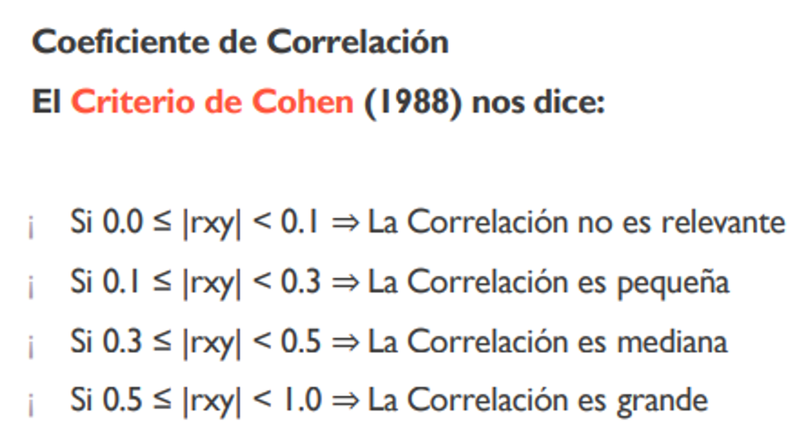
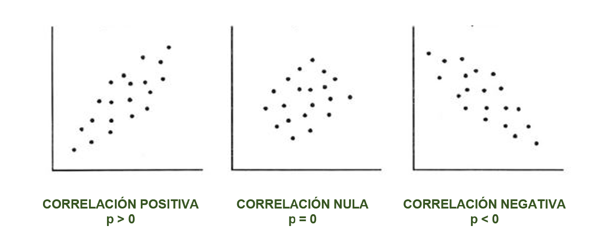
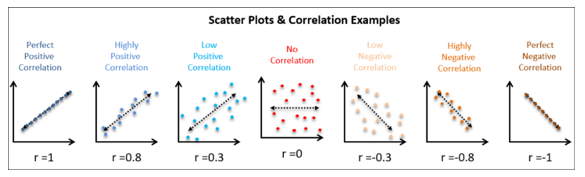

<center></center>

```{r,echo=FALSE, out.width="30%"}
knitr::include_graphics("logoPUCP.png") 
```

**FACULTAD DE CIENCIAS SOCIALES - PUCP**<br>

## Curso: POL 278 - Estadística para el análisis político 1 \| Semestre 2023 - 1 <br>

------------------------------------------------------------------------


## **Diagramas de dispersión y Correlación**

### Ideas clave

La correlación es en esencia una medida normalizada de asociación o covariación lineal entre dos variables.

-   La **correlación** es una medida de la relación (covariación) entre **dos variables cuantitativas.**

-   La manera más sencilla de saber si dos variables están correlacionadas es determinar si co-varían (varían conjuntamente).

-   Es importante hacer notar que **esta covariación o relación no implica necesariamente causalidad**: La correlación puede ser fortuita, como en el caso clásico de la correlación entre el número de venta de helados e incendios, debido al efecto de una tercera variable, la temperatura ambiental. A este tipo de relación se le llama "espuria".

### Coeficiente de Correlación de Pearson

-   "El Coeficiente de Correlación de Pearson es un estadístico paramétrico, pues se asume que ambas variables tienen una distribución aproximadamente normal, o sea, distribución normal bivariante".

-   Es una medida que **puede variar entre -1 y +1**, ambos extremos indicando correlaciones perfectas, negativa y positiva respectivamente.

-   Un valor de r = 0 indica que no existe relación lineal entre las dos variables.



### Supuestos

-   Normalidad = Teorema Central del Límite plantea que, en la medida que nuestro marco muestral es suficientemente grande (mayor a 121 casos), la variable aleatoria se aproxima a un comportamiento normal.

### Gráfico de dispersión



Otros ejemplos:



### Aplicación práctica

Vamos a analizar la relación entre el voto a Pedro Castillo y el **Índice de Desarrollo Humano (IDH)**.

El IDH es un importante indicador del desarrollo humano que elabora cada año el PNUD. Se trata de un indicador que, a diferencia de los que se utilizaban anteriormente que medían el desarrollo económico de un país, analiza la salud, la educación y los ingresos.

Pueden encontrar más información sobre este índice aquí: <https://hdr.undp.org/data-center>

Los datos que analizaremos se encuentran a nivel de provincia, pero pueden encontrar el IDH desagregado incluso a nivel de distritos.

Variables:

-   *PL*: Porcentaje de voto a Pedro Castillo (Perú Libre) en segunda vuelta de las elecciones presidenciales 2021
-   *habitantes*: Número de habitantes por provincia
-   *esperanza*: Esperanza de vida al nacer
-   *secundaria*: Población (18 años) con educación secundaria completa
-   *educación*: Años de educación (población de 25 a más)
-   *ingresos*: Ingreso familiar per cápita
-   *IDH*: Índice de Desarrollo Humano, en una escala de 0 a 1

### Cargamos nuestra base de datos:

```{r eval=FALSE}
library(rio)
data = import("Data Provincias.xlsx")
head(data)
```

### Ejercicio 1: Relación entre el voto a Pedro Castillo y el IDH

**Paso 1: Exploramos variables de interés**

Voto a Pedro Castillo:

```{r eval=FALSE}
str(data$PL)
```

Análisis descriptivo:

```{r eval=FALSE}
library(tidyverse)
data %>%
 summarize(Min = min(PL),
           Media = mean(PL),
           Mediana = median(PL),
           Max = max(PL))
```

IDH:

```{r eval=FALSE}
str(data$IDH)
```

Análisis descriptivo:

```{r eval=FALSE}
data %>%
 summarize(Min = min(IDH),
           Media = mean(IDH),
           Mediana = median(IDH),
           Max = max(IDH))
```

**Paso 2: Gráfico de dispersión**

Visualizamos la relación entre dos variables cuantitativas. Esta "nube" de puntos en el gráfico de dispersión nos da una idea visual (preliminar) de la probable relación entre las variables.

```{r eval=FALSE}
ggplot(data, aes(x=PL, y=IDH)) +
  geom_point(colour="red") +  xlab("Índice de Desarrollo Humano") +  ylab("% voto a Pedro Castillo") +
  ggtitle("Relación entre el IDH y el voto a Castillo") +
  theme_light()
```

¿Qué nos indica el gráfico? ¿Existirá correlación? ¿Con qué fuerza? ¿Qué sentido?

**Paso 3: Correlación**

Dos hipótesis:

-   H0 = No existe correlación entre el IDH y el % de voto a Pedro Castillo
-   H1 = Sí existe correlación entre el IDH y el % de voto a Pedro Castillo

```{r eval=FALSE}
#Prueba de correlación
cor.test(data$PL, data$IDH)
```

-   p \< 0.05 Rechazas la H0/Aceptas la H1 (sí hay correlación)
-   P \> 0.05 Aceptas la H0/Rechazas la H1 (no hay correlación)

**¿Qué nos dice el resultado?** Interpretación: Dado que el p-valor es menor a 0.05, no hay suficiente evidencia estadística para aceptar la H0. Por lo tanto, aceptamos la H1 de que "Sí existe correlación entre el IDH y el % de voto a Pedro Castillo".

El coeficiente es de -0.43 lo que quiere decir: (i) Se trata de una "correlación negativa"; es decir, relación indirecta (-) y (ii) Según los criterios de Cohen (1988), se trata de una correlación mediana.

### Ejercicio 2: Relación entre el voto a Pedro Castillo y los ingresos per cápita

**Paso 1: Exploramos variables de interés**

Ingresos per cápita:

```{r eval=FALSE}
str(data$ingresos)
```

Análisis descriptivo:

```{r eval=FALSE}
data %>%
 summarize(Min = min(ingresos),
           Media = mean(ingresos),
           Mediana = median(ingresos),
           Max = max(ingresos))
```

**Paso 2: Gráfico de dispersión**

```{r eval=FALSE}
ggplot(data, aes(x=PL, y=ingresos)) +
  geom_point(colour="red") +  xlab("% voto a Pedro Castillo") +  ylab("Ingresos per cápita") +
  ggtitle("Relación entre los ingresos per cápita y el voto a Castillo") +
  theme_light()
```

¿Qué nos indica el gráfico? ¿Existirá correlación? ¿Con qué fuerza? ¿Qué sentido?

**Paso 3: Correlación**

-   H0 = No existe correlación entre los ingresos per cápita y el % de voto a Pedro Castillo
-   H1 = Sí existe correlación entre los ingresos per cápita y el % de voto a Pedro Castillo

```{r eval=FALSE}
#Prueba de correlación
cor.test(data$PL, data$ingresos)
```

¿Qué nos dice el resultado?

### Ejercicio 3: Relación entre el voto a Pedro Castillo y el acceso a educación secundaria

**Paso 1: Exploramos variables de interés**

Educación secundaria:

```{r eval=FALSE}
str(data$secundaria)
```

Análisis descriptivo:

```{r eval=FALSE}
data %>%
 summarize(Min = min(secundaria),
           Media = mean(secundaria),
           Mediana = median(secundaria),
           Max = max(secundaria))
```

**Paso 2: Gráfico de dispersión**

```{r eval=FALSE}
ggplot(data, aes(x=PL, y=secundaria)) +
  geom_point(colour="red") +  xlab("Acceso a educación secundaria") +  ylab("% voto a Pedro Castillo") +
  ggtitle("Relación entre el acceso a educación secundaria y el voto a Castillo") +
  theme_light()
```

¿Qué nos indica el gráfico? ¿Existirá correlación? ¿Con qué fuerza? ¿Qué sentido?

**Paso 3: Correlación**

-   H0 = No existe correlación entre el acceso a educación secundaria y el % de voto a Pedro Castillo
-   H1 = Sí existe correlación entre el acceso a educación secundaria y el % de voto a Pedro Castillo

```{r eval=FALSE}
#Prueba de correlación
cor.test(data$PL, data$secundaria)
```

¿Qué nos dice el resultado?

En el ejericicio anterior, nuestro p= 0.14, el cual es mayor a 0.05. Por ello, **no se puede rechazar la H0** y, por el contrario, se debe concluir que no existe una correlación entre el acceso a la educación secundaria y el % de voto a Pedro Castillo.

### Ejercicio 4: Relación entre el voto a Pedro Castillo y la esperanza de vida

**Paso 1: Exploramos variables de interés**

Esperanza de vida:

```{r eval=FALSE}
str(data$esperanza)
```

Análisis descriptivo:

```{r eval=FALSE}
data %>%
 summarize(Min = min(esperanza),
           Media = mean(esperanza),
           Mediana = median(esperanza),
           Max = max(esperanza))
```

**Paso 2: Gráfico de dispersión**

```{r eval=FALSE}
ggplot(data, aes(x=PL, y=esperanza)) +
  geom_point(colour="red") +  xlab("Esperanza de vida") +  ylab("% voto a Pedro Castillo") +
  ggtitle("Relación entre la esperanza de vida y el voto a Castillo") +
  theme_light()
```

¿Qué nos indica el gráfico? ¿Existirá correlación? ¿Con qué fuerza? ¿Qué sentido?

**Paso 3: Correlación**

-   H0 = No existe correlación entre la esperanza de vida y el % de voto a Pedro Castillo
-   H1 = Sí existe correlación entre la esperanza de vida y el % de voto a Pedro Castillo

```{r eval=FALSE}
#Prueba de correlación
cor.test(data$PL, data$esperanza)
```

¿Qué nos dice el resultado?
